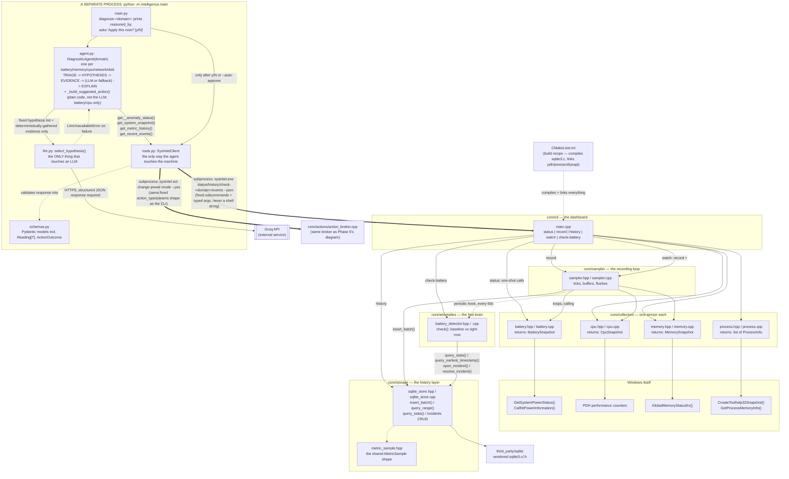
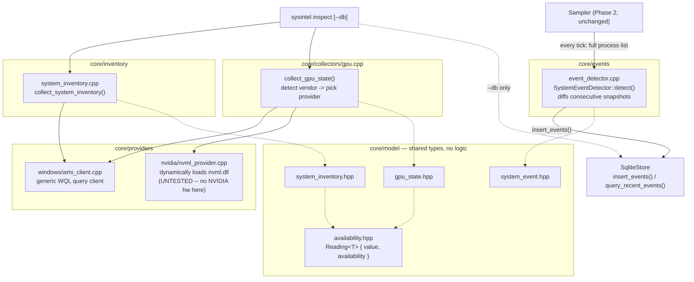
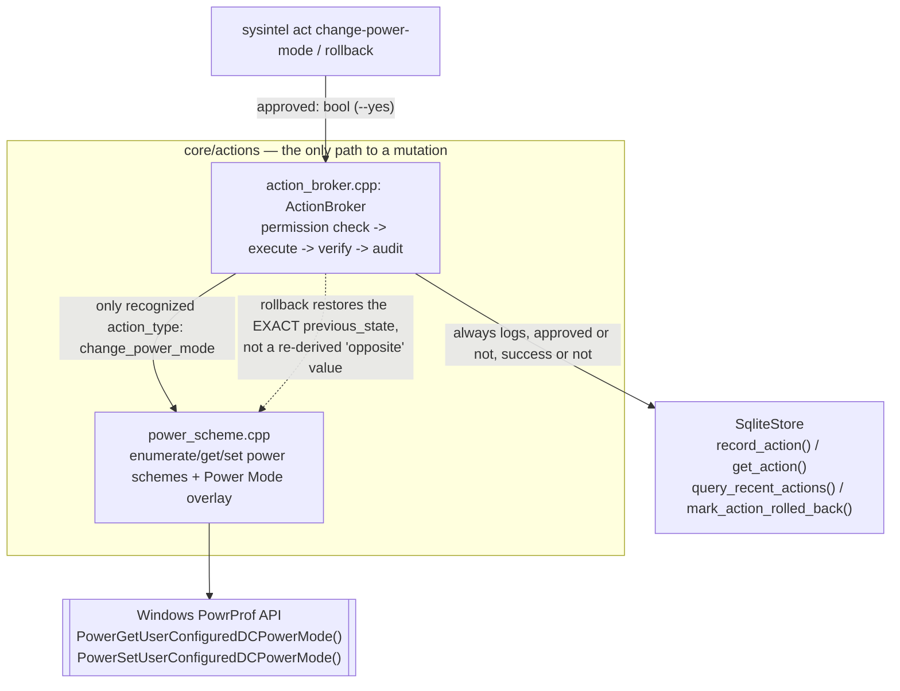

# System Intelligence

An OS-native AI agent for Windows that watches a machine's vitals (battery, CPU, memory, processes...), notices when something looks wrong, investigates the cause, and explains it with evidence — instead of a user having to manually dig through Task Manager, Event Viewer, and `powercfg`.

Full product thinking lives in:
- [`PRD — System Intelligence_ OS-Native AI Diagnostic Agent.md`](PRD%20—%20System%20Intelligence_%20OS-Native%20AI%20Diagnostic%20Agent.md) — what we're building and why
- [`Technical Design — System Intelligence v0.1.md`](Technical%20Design%20—%20System%20Intelligence%20v0.1.md) — how it's architected

## Where things stand right now

This repo now spans two runtimes:

**A C++ CLI** (`core/`, still no AI involved — everything here is plain statistics, not a model):
- `sysintel status` — one-shot snapshot (Phase 1: prove we can read real data from Windows)
- `sysintel record` — continuously samples battery/CPU/memory/network/disk/top-process-CPU/thermal and stores it in SQLite (Phase 2: history; network/disk added in Phase 9, top-process-CPU/thermal in Phase 11)
- `sysintel history <metric> --last <minutes>` — reads back min/avg/max over a time window
- `sysintel check-battery` / `check-memory` / `check-cpu` / `check-network` / `check-disk` / `check-top-cpu` / `check-thermal` — runs one anomaly check right now for that domain and prints the result (Phase 3 for battery; memory/cpu generalized in Phase 7; network/disk in Phase 9; top-cpu/thermal in Phase 11)
- `sysintel watch` — `record` plus an anomaly check for all seven domains every 60 seconds, in one long-running loop (Phase 3, extended in Phase 7, Phase 9, and Phase 11)
- `sysintel inspect [--db path]` — one unified snapshot: hardware inventory, live GPU state, and (with `--db`) recent events (Phase 3.5)
- `sysintel events [--last minutes]` — process start/stop and AC connect/disconnect events, synthesized from the recorder without needing ETW
- `sysintel act change-power-mode --level <best_power_efficiency|best_performance> [--reason "..."] [--yes]` — the first safe, reversible action: switches Windows 11's battery Power Mode, gated behind an explicit `--yes` (Phase 5)
- `sysintel act suspend-process <pid> [--reason "..."] [--yes]` — the second safe, reversible action: pauses a specific process (never terminates it) via ntdll's `NtSuspendProcess`, undoable with `act rollback` (Phase 12)
- `sysintel act rollback <action-id> [--yes]` — undoes a previous action, restoring its exact prior state
- `sysintel actions [--last n]` — the action audit log
- `sysintel power-schemes` — debug view of every power scheme/overlay Windows reports on this machine
- `sysintel network` — live per-adapter throughput, link speed, and (Wi-Fi) signal quality (Phase 8)
- `sysintel disk` — live per-disk read/write throughput, IOPS, and queue length (Phase 8)
- `sysintel top-cpu` — top processes by CPU usage, filling the one gap `status`'s memory-sorted list left since Phase 1 (Phase 8)
- `sysintel thermal` — CPU thermal zone temperature and fan RPM, best-effort (Phase 8)
- every command above also takes `--json` for machine-readable output

**A Python reasoning agent** (`intelligence/`, Phase 4 — real LLM reasoning via Groq, Phase 6 closes the loop into an actual action, Phase 10 generalizes it beyond battery, Phase 11 extends that to all seven domains):
- `diagnose-battery` / `diagnose-memory` / `diagnose-cpu` / `diagnose-network` / `diagnose-disk` / `diagnose-top-cpu` / `diagnose-thermal` `[--auto-approve] [--no-act]` — investigates an open anomaly in that domain: collects evidence via the CLI's `--json` output, sends it to an LLM for hypothesis selection, prints an evidence-based diagnosis in the PRD's Finding/Confidence/Evidence/Alternatives/Recommendation format, and — for battery/cpu/top-cpu/thermal, unless `--no-act` — offers a concrete, runnable action with an interactive approval prompt (or applies it automatically with `--auto-approve`)

Everything else (the native UI and AMD/Intel GPU telemetry) is designed but not built, and will sit on top of this same collector + storage + detector + tool-client code without needing to change it.

### Phase 8: the missing collectors — network, disk I/O, per-process CPU, thermal/fan

Confirmed direction: every hardware domain, not just battery — this phase fills the collector gaps Phase 7's "what's next" named explicitly. Each one is a live-state collector (no history storage yet, matching how GPU state already works) and hit a real, worth-recording problem along the way:

- **Network** (`core/collectors/network.cpp`, via the IP Helper API's `GetIfTable2`) — the first unfiltered pass reported **~25 "adapters"** for what is really one physical Wi-Fi card, because Windows creates a shadow row per internal NDIS filter driver (WFP filters, QoS packet scheduler bindings, Wi-Fi Direct virtual adapters) sharing the same interface *type* as the real adapter. Fixed by filtering on the `HardwareInterface` flag Windows exposes specifically for this, which brought it down to exactly the one real card, with genuine throughput (~3.8 KB/s) and Wi-Fi signal (87%). Separately, `iphlpapi.h`'s `MIB_IF_TABLE2`/`GetIfTable2` silently failed to declare at all until `ws2def.h`/`ws2ipdef.h` were included ahead of `windows.h` — the header's own doc comment says this, but only after empirically bisecting a `C2065: undeclared identifier` wall of errors down to a minimal isolated repro was it clear winsock2.h alone wasn't sufficient.
- **Disk I/O** (`core/collectors/disk_io.cpp`, via PDH's `\PhysicalDisk(*)` wildcard counters) — read/write throughput, IOPS, and queue length per physical disk, reusing the exact two-sample-rate trick the CPU collector already proved in Phase 1. Static disk *inventory* (model/size) already existed since Phase 3.5; this is the live-activity half of that domain.
- **Per-process CPU** (`core/collectors/process.cpp`, via PDH's `\Process(*)\% Processor Time` + `\Process(*)\ID Process`) — a gap flagged honestly since Phase 1 ("sorts by memory, not CPU"), closed the same way total CPU already worked, just per-instance. One caveat worth stating rather than hiding: matching the two counters' instances by *name* is approximate, and a real run showed two distinct "Code" instances both resolving to the same PID — a known PDH quirk (instance enumeration order isn't guaranteed to line up perfectly between two separately-queried counters), not something this implementation tries to paper over.
- **Thermal/fan** (`core/collectors/thermal.cpp`) — tried both real mechanisms (`MSAcpi_ThermalZoneTemperature` in the `ROOT\WMI` namespace for CPU temperature, `Win32_Fan` in `ROOT\CIMV2` for RPM), required extending `WmiClient` to accept a namespace parameter (it only ever talked to `ROOT\CIMV2` before). Result on this machine: thermal zone `unsupported` (the class/namespace itself isn't queryable here), fan `unavailable` (the `Win32_Fan` instance exists, but its `DesiredSpeed` field is empty) — exactly what the PRD's own warning about OEM fragmentation predicted, and exactly the distinction `Reading<T>` exists to preserve rather than collapsing both into a meaningless `0`.

```text
$ sysintel network
Network adapters (physical only)
  Intel(R) Wi-Fi 6E AX211 160MHz  [wifi] up
    Link speed      1201 Mbps
    Up / Down       0.36 / 0.39 KB/s
    Wi-Fi signal    87%

$ sysintel disk
  0 C: D:
    Read            97199.4 B/s
    Write           481947 B/s
    Reads/sec       1.98
    Writes/sec      36.58
    Queue length    0

$ sysintel thermal
Thermal zones
  cpu  unsupported
Fans
  Cooling Device  unavailable
```

Not yet done (as of Phase 8): none of these four feed into history/anomaly detection yet (only live state, like GPU), and the Python diagnostic agent still can't see any of them. Phase 9 closes that gap for network and disk; per-process CPU and thermal/fan remain live-state only (see below for why).

### Phase 9: network and disk join history/anomaly detection

The natural next step after Phase 8 landed the collectors: network and disk I/O are each already a single scalar rate (`network.total_bytes_per_sec`, `disk.total_bytes_per_sec`) once summed across adapters/disks, so they slot into the exact same generic `AnomalyDetector` that Phase 7 built for memory/CPU — no new detection logic needed, only wiring.

`Sampler::run()` gains a network and a disk sampling branch alongside the existing battery/memory/CPU ones, each on the same 5-second interval and each recording three metrics: sent/received (or read/write) separately, plus a combined total. The total is what gets baselined and alerted on — for anomaly purposes "is there unusual activity at all" matters more than which direction, and one combined metric avoids standing up two incident domains for what's really one collector each. The per-direction numbers are still recorded for `history`/manual inspection, just not checked for anomalies.

`check-network` and `check-disk` follow the exact `check-memory`/`check-cpu` pattern (thin calls into `run_check_generic`), and `watch` now runs all five domain checks every 60 seconds.

Per-process CPU and thermal/fan deliberately stay live-state-only: per-process CPU has no single metric to baseline (it's a ranked list of many short-lived instances, not one time series), and thermal was already found `unsupported`/`unavailable` on this hardware in Phase 8 — nothing to baseline against. Both remain exactly where GPU state already sits.

```text
$ sysintel check-network --db sysintel.db
Not enough history yet to evaluate network anomalies.

$ sysintel watch --db sysintel.db
Watching battery/CPU/memory/network/disk (recording + anomaly checks) -- Ctrl+C to stop
Anomaly baseline requires 14 day(s) of accumulated history.
```

`SysIntelClient` (`intelligence/tools.py`) now has a matching tool for every domain the CLI can check: `get_memory_anomaly_status()`, `get_cpu_anomaly_status()`, `get_network_anomaly_status()`, `get_disk_anomaly_status()`, all sharing one generic `AnomalyCheckReport` schema (`intelligence/schemas.py`) and one private `_get_anomaly_status(command, min_history_days)` helper, since all four call the same `check-<domain> --db --min-history-days --json` shape and get back the same JSON fields (`result`/`live_mean`/`baseline_mean`/`baseline_stddev`/`threshold`/`incident`). `get_battery_anomaly_status()` stays separate rather than joining that helper -- its JSON has renamed `*_watts` fields and a battery-specific result name (`no_recent_discharge` instead of `no_recent_samples`), a real shape difference, not just a naming one.

Not yet done (as of Phase 9): nothing in `agent.py` calls these four new tools yet -- `BatteryDiagnosticAgent` still only investigates battery incidents. Phase 10 closes that gap.

### Phase 10: one diagnosis engine, five domains

The battery-only diagnosis loop (Phase 6) had nothing battery-specific about its *state machine* -- triage, gather deterministic evidence, hand fixed hypotheses to an LLM, fall back to a rule if the LLM is unreachable -- except which check-* tool it called and how it phrased the headline evidence line. `agent.py`'s `BatteryDiagnosticAgent` is now a thin, name-preserving subclass of a new `DiagnosticAgent(tools, domain, min_history_days)` that the same loop runs for `"battery"`, `"memory"`, `"cpu"`, `"network"`, or `"disk"` -- the same "pull it out once there's a second real case to prove the abstraction against" move Phase 7 made for `AnomalyDetector`.

The one place this couldn't just be mechanical: hypotheses. Battery's original three ("system-wide CPU workload", "GPU activity", "unexplained") don't all transplant cleanly -- offering "system-wide CPU workload is responsible" as an explanation for a *CPU* anomaly is circular, not a hypothesis. So the cpu domain gets its own set (GPU-correlated load, a recently-started process, unexplained), and memory/network/disk share a third set built from the two general-purpose correlates this agent can actually check (CPU workload, a recently-started process) plus honest uncertainty. A small `_DomainConfig` per domain also records which hypothesis ID means "CPU workload correlates" (`None` for cpu itself) so the rule-based fallback doesn't have to know each domain's hypothesis wording, and whether the domain offers a suggested action at all.

That last point is deliberate, not an oversight: the Action Broker's only capability at this point (`change_power_mode`) is a real lever on CPU/GPU power draw, so it's offered for battery and cpu anomalies, exactly as before. Offering it for a memory leak or an elevated network/disk transfer would overstate what this agent can actually fix, so those three domains diagnose but never suggest an action -- `--no-act`'s behavior for them, always. (Phase 11 adds thermal to this list; Phase 12 gives top_cpu a second, more targeted action instead.)

`BatteryCheckReport` (renamed `*_watts` fields, battery-specific result names) and the generic `AnomalyCheckReport` from Phase 9 still aren't the same shape; `_normalize_check()` is the one place that difference gets flattened into a shared internal type so the rest of the agent never has to care which one it got.

```text
$ intelligence diagnose-network --min-history-days 1 --no-act
[reasoned by: rule-based fallback]

Finding
  System-wide CPU workload is correlated with the anomaly

Confidence: 70%

Evidence
  - network throughput: 500000.0 B/s observed vs 14770.79 B/s baseline (threshold 187015.97 B/s)
  - CPU utilization: 80.0% now vs 16.3% (24h average)

Recommended action
  Investigate which process is driving CPU usage; consider closing it or switching to a lower power plan.
```

Verified against seeded synthetic anomalies for cpu, battery, and network independently (a 500-sample baseline plus a spiked live window, inserted directly into `metric_samples`) -- each correctly detected, diagnosed through the rule-based fallback (no `GROQ_API_KEY` in this environment), and the cpu domain correctly skipped the circular "CPU workload" branch entirely rather than reasoning about it. Battery's suggested-action `reason` string came out byte-for-byte identical to the pre-refactor wording (`"battery drain anomaly: 22.0W vs 8.3W baseline"`), confirming the generalization didn't regress the one path that was already validated.

Not yet done (as of Phase 10): the fallback's rule-based reasoning is still shallow (one CPU-correlation check, nothing about candidate processes or GPU) -- exactly as it was for battery before this phase, just now shared. Per-process CPU and thermal/fan (Phase 8's other two collectors) still weren't wired into detection at all. Phase 11 closes that second gap.

### Phase 11: per-process CPU and thermal join the loop too

Phase 9 left per-process CPU and thermal/fan out specifically because neither reduces to one scalar time series as cleanly as network/disk did -- per-process CPU is a ranked list of many short-lived instances, and thermal covers two different physical quantities (temperature, fan speed). Both turned out to have a real scalar worth baselining once framed narrowly enough, rather than needing a fundamentally different detection mechanism:

- **Per-process CPU** (`process.top_cpu_percent`) -- not "every process's CPU," just the single busiest process's CPU% each tick. That's a genuinely different signal from `cpu.utilization` (the system-wide total): a runaway process can spike this while the system stays moderately loaded, or a broadly busy system can spike the total without any one process standing out. `check-top-cpu` and `watch` reuse the same `AnomalyDetector` as everything else, keyed on a `"top_cpu"` domain.
- **Thermal** (`thermal.cpu_temp_celsius`, `thermal.fan_rpm`) -- recorded as the *maximum* across all zones/fans that actually report a value, and only when at least one does. On hardware where thermal is `unsupported`/`unavailable` (this machine, per Phase 8's own findings), this simply records nothing, the same honest absence `battery.discharge_watts` already models while on AC power. Temperature is what `check-thermal` evaluates for anomalies; fan RPM is recorded for `history` but not checked on its own, the same "record more than you check" pattern network/disk's per-direction numbers already used.

`SysIntelClient` gained `get_top_cpu_anomaly_status()` and `get_thermal_anomaly_status()`, and `agent.py`'s `_DOMAINS` table gained matching entries -- `top_cpu` reuses the existing three-domain `_RESOURCE_HYPOTHESES` set (system-wide CPU load and top-process CPU are different-enough metrics that "is the total also elevated" is real evidence, not circular the way it would be for the cpu domain itself), while `thermal` gets its own set pairing CPU- and GPU-correlated heat, matching the physical reality that both are real heat sources. Both offer the `change_power_mode` suggested action (throttling directly addresses a runaway process, and is arguably the single most on-the-nose use of that action for elevated temperature), so `main.py` gained `diagnose-top-cpu` and `diagnose-thermal` alongside the other five.

One real bug caught while wiring this up: the evidence lines for "not enough history" / "no active anomaly" built their check-subcommand name as `f"check-{self.domain}"`, which is correct for every domain except `top_cpu` -- the CLI command is hyphenated (`check-top-cpu`), not underscored. `_DomainConfig` gained a `cli_name` field to carry the CLI's actual spelling instead of assuming it matches the Python-identifier-friendly domain key.

```text
$ intelligence diagnose-top-cpu --min-history-days 1 --no-act
Finding
  System-wide CPU workload is correlated with the anomaly
Evidence
  - top process's CPU usage: 95.0% observed vs 13.65% baseline (threshold 42.54%)
  - CPU utilization: 80.0% now vs 16.3% (24h average)

$ intelligence diagnose-thermal --min-history-days 1 --no-act
Finding
  System-wide CPU workload is correlated with the temperature rise
Evidence
  - CPU temperature: 92.0C observed vs 45.81C baseline (threshold 68.72C)
```

Verified the same way as Phase 10: seeded synthetic anomalies for both `process.top_cpu_percent` and `thermal.cpu_temp_celsius` directly into `metric_samples`, confirmed `check-top-cpu`/`check-thermal` detect them, and ran both `diagnose-*` commands end-to-end through the rule-based fallback. Also re-ran the battery seeded scenario to confirm still-byte-for-byte-identical output -- no regression from the `_DomainConfig` field addition.

Not yet done (as of Phase 11): this is genuinely comprehensive detection coverage across every domain the CLI can observe, but the rule-based fallback's shallowness (flagged in Phase 10) still applies to all seven domains equally, and the Action Broker still has exactly one action. Phase 12 adds the second.

### Phase 12: a second safe action -- suspend, not terminate

Every diagnosis so far, LLM or fallback, has been recommending the same kind of fix in prose (`recommended_action`) that the agent had no way to actually offer: "investigate which process is driving usage; consider closing it." The Action Broker's only lever, `change_power_mode`, doesn't target a specific process at all. This phase adds one that does -- `suspend_process` -- while keeping the project's reversibility bar intact: the PRD's own Level 3 "reversible action" list names "temporarily suspend process," not "terminate," specifically because a suspended process can be resumed exactly as it was and a terminated one cannot. `core/actions/process_control.cpp` goes through ntdll's undocumented-but-decades-stable `NtSuspendProcess`/`NtResumeProcess` (the same mechanism Process Explorer's "Suspend" menu item uses) rather than `TerminateProcess`, for exactly that reason.

Wiring a second action type turned `ActionBroker::rollback()` into the same kind of generalization Phase 7 did for `AnomalyDetector`: it used to hardcode "restore the power-mode GUID" as the only possible undo, and now dispatches on the recorded action's type (`rollback_change_power_mode()` / `rollback_suspend_process()`) the same way `execute()` already dispatched on `action_type`. `suspend_process`'s "previous state" to restore is the pid itself -- the same role a power-mode GUID played before, just a different kind of "the exact thing to hand back to whatever undoes this."

Safety lives in two places, and only one of them is enforced: `handle_suspend_process()` in the C++ broker refuses a fixed denylist of protected process names (`System`, `csrss.exe`, `explorer.exe`, `sysintel.exe` itself, etc.) plus reserved pids (0, 4, and the broker's own pid) before ever calling `suspend_process()` -- that's the actual gate. `agent.py` keeps a hand-synced copy of the same list purely so it doesn't *suggest* suspending something it knows will be refused (the single busiest process is very often `System` or `Memory Compression`, both protected); if it did suggest one anyway, the C++ side would still refuse it. Belt, then suspenders, with the C++ side as the one that actually matters.

`_build_suggested_action()`'s dispatch also moved out of `main.py`, which used to hardcode `apply_change_power_mode()` as the only thing a suggested action could ever be -- `handle_suggested_action()` now branches on `action.action_type`, and a small `_equivalent_cli_command()` helper generates the right "run it yourself later" hint for whichever action type was declined.

This is deliberately scoped to one domain: only `top_cpu` offers `suspend_process`, because it's the one domain whose evidence identifies an actual culprit process (`get_top_processes_by_cpu()`, queried fresh at suggestion time rather than reused from evidence-collection time, since an LLM round-trip can take several seconds). Every other domain keeps `change_power_mode` exactly as before -- a memory leak or elevated network/disk throughput doesn't have "the one process to suspend" identified with the same confidence.

```text
$ sysintel act suspend-process 6396 --reason "test" --yes --json
{"known_action":true,...,"success":true,"previous_state":"6396","new_state":"suspended",
 "message":"suspended 'Notepad.exe' (pid 6396)","action_id":"suspend_process-..."}

$ sysintel act rollback suspend_process-... --yes --json
{"known_action":true,...,"success":true,"previous_state":"suspended","new_state":"running",
 "message":"resumed pid 6396"}
```

Verified against a real, disposable Notepad process, not just JSON shapes: suspended it, confirmed via `Get-Process`'s `Responding` flag that it had actually frozen (`False`), rolled the action back, and confirmed it responded again (`True`) -- a genuine round trip, not just a status-string check. Also verified the protected-name refusal (`explorer.exe`, reserved pid `4`) and an unknown-action-id rollback both fail the way they should. On the Python side, ran a seeded `top_cpu` anomaly through the real LLM (not the fallback) and confirmed it correctly skipped `System`/`Memory Compression` and suggested suspending an actual ordinary process instead, then exercised `apply_suspend_process()`/`rollback_action()` directly against another disposable Notepad to confirm the same round trip works through the Python client, not just the CLI. Re-ran battery's seeded scenario once more to confirm still byte-for-byte-identical suggested-action wording -- no regression from generalizing `handle_suggested_action()`'s dispatch.

Not yet done: `_build_suspend_action()`'s reasoning is still just "closest available candidate that isn't protected" -- it doesn't yet correlate the top-CPU process against `processes_started_near_incident_onset` the way a sharper diagnosis could (is this actually the process that started the anomaly, or just whoever happens to be busiest right now). The native UI and AMD/Intel GPU telemetry remain the larger deferred items.

### Phase 7: one detector, three domains — the start of "diagnose everything"

The direction from here is explicit: cover every hardware domain, not just battery. The first step toward that wasn't a new collector — it was noticing that the battery-drain detector's actual logic (trailing baseline mean/stddev vs. a short "right now" window, gated on accumulated history, hysteresis on resolve) had nothing battery-specific about it *except the metric name*. `core/anomalies/anomaly_detector.hpp/cpp` pulls that logic out into a metric-agnostic `AnomalyDetector`, and `battery_detector.cpp` is now a thin ~50-line wrapper that configures it with `battery.discharge_watts` and translates result names back to `BatteryCheckResult`'s existing enum — so the CLI's `check-battery --json` shape and Python's `schemas.py` didn't need to change at all.

This was deliberately *not* built generic from day one (see the project's running "no premature abstraction" rule) — it only became a generic class once there was a second real domain to prove the abstraction against. That second and third domain are `check-memory` and `check-cpu`, reusing history the recorder was already collecting since Phase 2 — no new collector work needed for either. `sysintel watch` now checks all three every 60 seconds.

Verified with seeded synthetic data for each new domain independently: real anomalies correctly detected with sensible baseline/threshold values (e.g. CPU baseline 17.1%, spike to 85.2%, threshold 48.2%; memory baseline 61.0%, spike to 95.2%, threshold 91.6%), no false positive on normal data, and — critically — a battery-specific regression test confirming `check-battery`'s behavior is bit-for-bit unchanged after the refactor (same incident IDs, same thresholds, same ongoing/no-duplicate behavior as the original Phase 3 test).

```text
$ sysintel check-cpu --db sysintel.db
ANOMALY DETECTED (cpu): cpu-1789476582194
  Observed  85.2%
  Baseline  17.1%
  Threshold 48.2%

$ sysintel check-memory --db sysintel.db
ANOMALY DETECTED (memory): memory-1789476582254
  Observed  95.2%
  Baseline  61.0%
  Threshold 91.6%
```

Not yet done (as of Phase 7): the Python diagnostic agent still only knows how to investigate battery incidents (`get_battery_anomaly_status()`); memory and CPU anomalies are detected but nothing diagnoses *why* yet. Phase 10 generalizes the diagnosis loop itself; new collectors (network, disk I/O, per-process CPU attribution, thermal/fan) came first, in Phase 8.

### Phase 6: closing the loop, from diagnosis to action

Phases 4 and 5 built two halves that never talked to each other: a diagnostic agent that could only print a text recommendation, and an Action Broker that could only be invoked by hand. This phase connects them — but deliberately *not* by letting the LLM decide what to execute.

The design keeps the same boundary this whole project has held since Phase 4: the model only ever produces prose. `agent.py`'s `_build_suggested_action()` is a plain function, not an LLM call — it looks at whether there's an open/ongoing anomaly (nothing else) and always proposes the same fixed `change_power_mode` / `best_power_efficiency` action, regardless of which hypothesis won. That's a deliberate choice, not a limitation being papered over: Best Power Efficiency mode reduces both CPU- and GPU-adjacent power draw at the OS level, so it's a reasonable, fully-reversible thing to try even when the root cause isn't pinned down exactly — and because it's cheap to undo, it doesn't need to wait for perfect diagnostic certainty the way a riskier action would.

`main.py` is the actual approval gate: it prints the suggested action and asks `Apply this now? [y/N]` before anything happens, unless `--auto-approve` was passed explicitly. Only after a yes does `tools.py`'s `apply_change_power_mode()` call through to `sysintel act change-power-mode --yes` — the exact same Action Broker path a human typing the command directly would take.

Verified end-to-end on the real machine, twice: once with the interactive prompt declined (confirmed the machine's power mode was untouched, and the exact equivalent command was printed for later use), and once with `--auto-approve` after manually switching to a different mode first (confirmed the diagnosis correctly detected the mismatch, applied the real change through the broker, and independent re-reads confirmed both the change and the final restored state).

```text
$ intelligence diagnose-battery --db sysintel.db --sysintel-exe build\sysintel.exe
[reasoned by: LLM (Groq)]
...
Suggested action
  Switch Windows' battery Power Mode to 'Best power efficiency'

Apply this now? [y/N]: n
Not applied. Run it yourself later with:
  sysintel act change-power-mode --level best_power_efficiency --reason "battery drain anomaly: 21.9W vs 8.4W baseline" --yes
```

```text
$ intelligence diagnose-battery --db sysintel.db --sysintel-exe build\sysintel.exe --auto-approve
[reasoned by: LLM (Groq)]
...
Suggested action
  Switch Windows' battery Power Mode to 'Best power efficiency'
  (--auto-approve given, applying without an interactive prompt)

Applied: changed and verified
  Previous state   DED574B5-45A0-4F42-8737-46345C09C238
  New state        961CC777-2547-4F9D-8174-7D86181B8A7A
  Action id        change_power_mode-1789475982288  (undo with: sysintel act rollback change_power_mode-1789475982288 --yes)
```

### Phase 5: the Action Broker, and the first safe action

Up to now this project only observes and explains. `sysintel act` is the first thing that can actually change the machine — and it's built around the PRD's Action Broker: permission check → (only if approved) execute → verify → audit record. There is exactly one path from a recommendation to a real change, and it isn't the Python agent or the LLM — it's this broker, invoked explicitly by a human.

The action itself: **change the Windows 11 "Power Mode" slider** (Settings → System → Power), specifically the battery (DC) side of it — directly addressing the battery-drain scenario this whole project is built around. Two real, hardware-verified discoveries shaped this:

1. **Classic multi-plan switching (`powercfg /list`-style) doesn't work on this dev machine at all** — it only has a single "Balanced" scheme registered, no "Power Saver"/"High Performance" to switch to. `enumerate_power_schemes()` and `powercfg /list` agree on this. So the *first* safe-action candidate (switch between classic power plans) was discarded before being built, in favor of the Power Mode slider, which works regardless of how many classic schemes exist.
2. **The Power Mode overlay GUIDs are not the classic `GUID_MAX_POWER_SAVINGS`-style constants** — an earlier version of this code assumed they were reused; live testing on this machine proved that wrong (the API call succeeded but returned a GUID matching neither constant). The actual GUIDs were found by asking Windows directly — enumerate with `ACCESS_OVERLAY_SCHEME`, read each one's friendly name back — and cross-checked against what `PowerGetUserConfiguredDCPowerMode()` genuinely returned live. Only `best_power_efficiency`'s mapping has that live cross-check; `best_performance` is inferred from its reported name ("Max Performance Overlay") and flagged lower-confidence in the code.

Verified end-to-end on the real machine: dry-run preview (no side effects, confirmed by independent re-read), real execution with independent verification, full audit trail, rollback restoring the *exact* prior state, and refusal paths (unknown level, double rollback, rollback of a nonexistent action id) all behaving correctly. The machine's power mode is back to exactly what it was before any of this testing started.

```text
$ sysintel act change-power-mode --level best_performance --reason "testing" --db sysintel.db
Preview (not applied): dry run: would change DC power mode to 'best_performance'. Pass approval to apply.
  Current state    961CC777-2547-4F9D-8174-7D86181B8A7A
  Would become     DED574B5-45A0-4F42-8737-46345C09C238

$ sysintel act change-power-mode --level best_performance --reason "testing" --db sysintel.db --yes
Applied: changed and verified
  Previous state   961CC777-2547-4F9D-8174-7D86181B8A7A
  New state        DED574B5-45A0-4F42-8737-46345C09C238
  Action id        change_power_mode-1789475388157  (use 'sysintel act rollback change_power_mode-1789475388157' to undo)

$ sysintel act rollback change_power_mode-1789475388157 --db sysintel.db --yes
Applied: rolled back and verified
  Previous state   DED574B5-45A0-4F42-8737-46345C09C238
  New state        961CC777-2547-4F9D-8174-7D86181B8A7A
```

### Phase 3.5: a Unified System Model

Rather than the agent eventually needing dozens of scattered tools (`get_cpu()`, `get_gpu()`, `get_fans()`, ...), this phase reorganizes what we collect into four named pillars:

| Pillar | What it is | Where it lives |
|---|---|---|
| **Inventory** | Things that rarely change: CPU/GPU/disk model, OS version, battery chemistry | `core/inventory/`, refreshed on demand |
| **State** | Things that change constantly: current battery/CPU/memory/GPU readings | `core/collectors/`, already existed since Phase 1 |
| **History** | State over time | SQLite, already existed since Phase 2 |
| **Events** | Discrete "something changed" facts: a process started, AC got unplugged | `core/events/`, new this phase |

The other new piece is an **availability-aware value type**. A bare `0` or `null` is ambiguous — does a fan reading of `0` mean the fan is off, or that this laptop just doesn't expose fan telemetry at all? Every new reading in this phase is a `Reading<T>`, which carries both a value *and* one of `ok` / `unsupported` / `unavailable` / `error`, so the difference is never lost.

`sysintel status` gives you something like:

```text
System Intelligence -- status

Power
  Source          AC
  Charge          88%
  Charge rate     20.7 W

CPU
  Utilization     16.4%

Memory
  Used            11.3 / 15.6 GB  (72%)

Top Processes (by memory)
  Code.exe                464.4 MB
  explorer.exe            456.4 MB
  ...
```

`sysintel record` runs until Ctrl+C, and `sysintel history cpu.utilization --last 5` then gives you:

```text
cpu.utilization -- last 5 minutes (21 samples)

  Min   7.18
  Avg   13.69
  Max   26.68
```

And `sysintel check-battery` — once there's at least 14 days of accumulated battery history (configurable with `--min-history-days`, mainly for testing) — gives you one of:

```text
Not enough history yet to evaluate battery anomalies.
```
```text
Battery normal. Baseline 8.4W (+/-1.5W)
```
```text
ANOMALY DETECTED: battery-1789471660271
  Observed  21.9 W
  Baseline  8.4 W
  Threshold 15.4 W
```

And once there's an open incident, `python -m intelligence.main diagnose-battery` investigates it — hypothesis selection now goes to a real LLM call (Groq), with evidence collection staying entirely deterministic:

```text
[reasoned by: LLM (Groq)]

Finding
  System-wide CPU workload is responsible -- Battery power consumption (21.88 W) exceeds
  the threshold (15.36 W), coinciding with a sharp rise in CPU utilization (75.8% recent
  average vs 23.6% baseline).

Confidence: 75%

Evidence
  - Battery discharge: 21.88W observed vs 8.39W baseline (threshold 15.36W)
  - Live battery watts (21.88) are well above both baseline and the defined threshold.
  - CPU recent 5-minute average (75.8%) is far higher than its 24-hour baseline (23.6%),
    matching the timing of the power spike.
  - GPU telemetry is marked as unsupported, so no evidence can confirm or refute GPU
    involvement.

Alternative explanations
  - GPU activity is responsible (only meaningful when a GPU actually reports usable
    telemetry -- most machines/vendors don't yet)
  - Unexplained by evidence this agent currently checks

Recommended action
  Identify and limit the high-CPU processes, reduce background work, and consider
  power-saving settings for the CPU.

Risk
  Reducing or terminating active processes may interrupt work or degrade user experience.

Expected result
  CPU utilization should drop toward baseline, bringing battery power draw back below
  the threshold.
```

When CPU is normal too, the same model correctly drops confidence rather than forcing an answer — verified side by side against the CPU-elevated case above:

```text
[reasoned by: LLM (Groq)]

Finding
  Unexplained by evidence this agent currently checks -- Battery power draw (21.95 W) is
  well above the threshold (15.36 W), but CPU usage is only marginally higher than its
  24h baseline and GPU telemetry is unavailable, leaving no concrete evidence for a
  CPU- or GPU-driven cause.

Confidence: 30%
```

If the LLM call fails for any reason (no API key, network error, malformed response), a deterministic rule-based fallback takes over automatically and says so explicitly (`[reasoned by: rule-based fallback]`) rather than crashing — verified by running with `GROQ_API_KEY` unset.

`sysintel inspect` pulls inventory + live GPU state (and, with `--db`, recent events) into one screen:

```text
====== SYSTEM INTELLIGENCE: inspect ======

SYSTEM
  Manufacturer    Dell Inc.
  Model           XPS 9315
  OS              Microsoft Windows 11 Home Single Language

CPU
  Model           12th Gen Intel(R) Core(TM) i7-1250U
  Cores           10
  Threads         12

GPU
  [0] Intel -- Intel(R) Iris(R) Xe Graphics
      VRAM            2048 MB

GPU STATE (live)
  [0] Intel -- Intel(R) Iris(R) Xe Graphics
      Utilization unsupported
      VRAM            unsupported
      Temperature unsupported
      Power (W)   unsupported
      P-State     unsupported

MEMORY
  DIMMs           8
  Total           16 GB

BATTERY
  Chemistry       Unknown
  Design cap.     unavailable
  Full charge     unavailable

RECENT EVENTS
  1789473073420  process.started  pid=16948  name=conhost.exe
  1789473062157  process.stopped  pid=3080  name=Notepad.exe
  1789473053951  power.ac_disconnected

===========================================
```

Every `unsupported` above is real, verified behavior on this dev machine (an Intel-only laptop) — not a placeholder. That's the whole point of the availability-aware `Reading<T>` type: this machine's GPU genuinely doesn't expose utilization/temperature/power through any provider this project has (yet), and the output says so explicitly instead of printing a misleading `0`.

When CPU is normal too, it says exactly that instead of guessing:

```text
Finding
  Unexplained by anything this build can currently measure (likely GPU activity or a driver regression -- no collector for either yet)

Confidence: 60%
```

## How the pieces connect



Nothing here talks to Windows directly except the four `collectors/` files — everything else (`main.cpp`, `sampler.cpp`) just asks a collector for its snapshot. That separation is deliberate: later, the background service and the AI reasoning layer will call these exact same collector functions, and none of the collector code will need to change.

Notice the `python -m intelligence.main` box is a **separate process**, connected to everything above it by exactly one edge: `tools.py` calling `sysintel.exe` as a subprocess with fixed subcommands (`status`, `history`, `check-battery`) and typed arguments — never a free-form string handed to a shell. That's the whole point of the boundary: the reasoning layer can be wrong, slow, or (eventually) an actual LLM making mistakes, and none of that can turn into an arbitrary command against the machine. The real product will eventually replace this subprocess+JSON transport with the named-pipe IPC from the tech design, but the *tools* the agent calls won't need to change — only what's underneath them.

The new `PYMAIN -> TOOLS -> action_broker.cpp` edge at the bottom is Phase 6's addition, and it's worth tracing carefully: it starts at `PYMAIN`, not `AGENT` or `LLM` — the approval prompt lives in `main.py`, gating the call before `tools.py` is ever invoked for it. `AGENT` never calls `TOOLS`' action methods itself; it only *returns* a `suggested_action` value for `PYMAIN` to look at. That's what keeps the LLM's blast radius exactly where it was in Phase 4: it can influence what gets *suggested* in prose, but the actual decision to invoke the broker, and the fixed shape of what gets sent to it, never passes through the model at all.

### Phase 3.5's additions: Inventory, Events, and GPU dispatch

This is a separate diagram rather than folding into the one above, since cramming both in would make neither legible.



### Phase 5's addition: the Action Broker



Notice the broker is the only node with an edge into `power_scheme.cpp`'s write functions (`set_dc_power_mode*`) — nothing else in this codebase, including the Python agent, can reach them. And notice `CLI4 -> AB` carries `approved` as an explicit boolean the *caller* controls (today, a `--yes` flag; later, a UI approval dialog) — the broker itself never decides to skip approval.

## What each file does, in easy words

### [`core/collectors/battery.hpp`](core/collectors/battery.hpp)
Just a label — defines a small box called `BatterySnapshot` to carry battery facts around: is there a battery, is it plugged in, what % charge, and how many watts it's charging/draining at. No logic here, just "here's the shape of the data."

### [`core/collectors/battery.cpp`](core/collectors/battery.cpp)
Does the actual work. Calls two Windows functions:
- `GetSystemPowerStatus()` — the simple one: charge %, plugged in or not.
- `CallNtPowerInformation(SystemBatteryState, ...)` — the detailed one: exact wattage.

Gotcha we hit and fixed: Windows stores that wattage in a slot that's technically "can't be negative," but secretly does go negative (for draining) by wrapping around like an odometer rolling backwards. We had to tell the code "treat this as a number that can be negative," otherwise a normal 14-watt drain showed up as "4 million watts."

### [`core/collectors/cpu.hpp`](core/collectors/cpu.hpp) / [`cpu.cpp`](core/collectors/cpu.cpp)
Windows doesn't have a single "CPU % right now" button — it only tracks total time spent working. So this file measures twice, one second apart, and the *difference* between the two readings is the utilization percentage. That's why the tool pauses for about a second while running — it's genuinely waiting to take that second measurement. The tool doing the measuring is called **PDH** (Performance Data Helper), Microsoft's built-in library for exactly this.

### [`core/collectors/memory.hpp`](core/collectors/memory.hpp) / [`memory.cpp`](core/collectors/memory.cpp)
The easy one. `GlobalMemoryStatusEx()` is a single function call that hands back total RAM, available RAM, and a ready-made "% used" number — no waiting or math required.

### [`core/collectors/process.hpp`](core/collectors/process.hpp) / [`process.cpp`](core/collectors/process.cpp)
Three steps:
1. Take a snapshot of every running process (like Task Manager's list) via `CreateToolhelp32Snapshot`.
2. For each one, ask how much memory it's using via `GetProcessMemoryInfo` (some processes refuse this — those get skipped, that's fine).
3. Sort biggest-to-smallest and keep the top 8.

`get_top_processes_by_memory()` sorts by **memory**; `get_top_processes_by_cpu()` (Phase 8) closes the gap this file honestly flagged since Phase 1, via PDH's `\Process(*)\% Processor Time` + `\Process(*)\ID Process` wildcard counters (two-sample rate, same trick as the total CPU collector), matching the same instance name to a PID across both. Worth stating plainly: that name-based matching is approximate — a real run showed two distinct "Code" instances both resolving to PID 3736, a known PDH quirk (instance array order isn't guaranteed to line up identically between two separately-queried counters). Not something this code tries to paper over with false precision.

It also exposes `get_all_process_identities()` — every PID+name with *no* memory query, cheap enough to call every ~1 second purely so the event detector below can diff it against the last tick.

### [`core/model/availability.hpp`](core/model/availability.hpp)
The foundational addition this phase: `Reading<T>` pairs a value with one of four states — `ok`, `unsupported` (this hardware/vendor genuinely doesn't expose it), `unavailable` (should be readable, but this particular query failed), or `error`. Every new collector from this phase on returns `Reading<T>` fields instead of a bare number, so "the fan is off" and "we have no idea if there's even a fan" are never confused with each other.

### [`core/model/system_inventory.hpp`](core/model/system_inventory.hpp) / [`core/inventory/system_inventory.cpp`](core/inventory/system_inventory.cpp)
The "things that don't change often" pillar — CPU/GPU/disk model, OS version, memory DIMM count, battery chemistry. Implemented via WMI (`Win32_Processor`, `Win32_VideoController`, `Win32_OperatingSystem`, `Win32_PhysicalMemory`, `Win32_DiskDrive`, `Win32_Battery`) — the first time this codebase queries WMI rather than raw Win32/PDH. `Win32_Battery`'s `DesignCapacity`/`FullChargeCapacity` come back genuinely empty on this dev machine's OEM controller, which is exactly the real-world case the availability type exists for: the battery *is* there (so it's not "unsupported"), the fields are just unpopulated (so it's "unavailable").

### [`core/providers/windows/wmi_client.hpp`](core/providers/windows/wmi_client.hpp) / [`wmi_client.cpp`](core/providers/windows/wmi_client.cpp)
A small reusable wrapper around WMI's COM API (`IWbemLocator`, `IWbemServices`, SAFEARRAYs of property names, VARIANTs...) so every inventory field doesn't have to repeat that boilerplate. Give it a WQL string, get back plain string-keyed rows. If WMI itself is unreachable (e.g. the service is disabled), `ok()` is false and every query just returns empty rather than crashing — callers treat that the same way they treat a missing field.

The constructor takes an optional WMI namespace, defaulting to `ROOT\CIMV2` where every class this project queried through Phase 7 lived. Phase 8's thermal collector needed `ROOT\WMI` instead (where ACPI thermal zones live), which is what the parameter is for — added only once a second real namespace was actually needed, not speculatively.

### [`core/model/gpu_state.hpp`](core/model/gpu_state.hpp) / [`core/collectors/gpu.cpp`](core/collectors/gpu.cpp)
The vendor-dispatch pattern: detect each GPU's vendor via WMI (same source the inventory uses), then hand NVIDIA adapters to the NVML provider and mark AMD/Intel adapters `unsupported` (no provider built for either yet). If WMI says there's an NVIDIA GPU but NVML couldn't be loaded, that's reported as `unavailable`, not `unsupported` — the hardware path exists, the telemetry provider just isn't reachable right now. This distinction is only meaningful because of the availability type above.

### [`core/providers/nvidia/nvml_min.hpp`](core/providers/nvidia/nvml_min.hpp) / [`nvml_provider.hpp`](core/providers/nvidia/nvml_provider.hpp) / [`nvml_provider.cpp`](core/providers/nvidia/nvml_provider.cpp)
GPU utilization/VRAM/temperature/power/performance-state for NVIDIA GPUs, via NVIDIA's NVML. Rather than linking a static import lib (which requires the CUDA Toolkit as a build dependency — not something an end user's machine would have), this hand-declares the small stable subset of NVML's C ABI it needs and loads `nvml.dll` dynamically with `LoadLibrary`/`GetProcAddress` at runtime. That's also exactly why the project still compiles and runs cleanly here: this dev machine has only an Intel iGPU, `nvml.dll` doesn't exist on it, `LoadLibraryA` returns null, and every GPU reading correctly falls back to `unavailable`/`unsupported` instead of failing to build.

**Caveat, stated plainly:** this was written without access to NVIDIA hardware. The dynamic-loading mechanism and struct layouts follow NVIDIA's publicly documented, stable NVML ABI, and the negative path (no `nvml.dll` present) is verified working — but the actual "read real GPU telemetry" path has not been exercised against a real device or driver. Verify on NVIDIA hardware before relying on it.

### [`core/model/network_state.hpp`](core/model/network_state.hpp) / [`core/collectors/network.cpp`](core/collectors/network.cpp)
Per-adapter throughput (via a two-sample rate over ~1 second, same trick as `cpu.cpp`), link speed, and Wi-Fi signal quality, via the IP Helper API (`GetIfTable2`) and, for signal quality, the WLAN API. Filters to `InterfaceAndOperStatusFlags.HardwareInterface && !FilterInterface` — without that filter, this reported ~25 rows for one physical card, since Windows creates a shadow `MIB_IF_ROW2` entry per internal NDIS filter driver bound to the same adapter, sharing its interface type. Wi-Fi signal quality is best-effort: the WLAN API reports on whichever interface is currently *connected*, not addressable per-adapter by the same LUID the throughput counters use, so it's not matched with the same precision.

Needed an unusual include order to compile at all: `ws2def.h`/`ws2ipdef.h` explicitly, before `windows.h` — `iphlpapi.h`'s own doc comment says `netioapi.h` (where `MIB_IF_TABLE2`/`GetIfTable2` actually live) expects those headers already included, and `winsock2.h` alone wasn't sufficient in practice. Found by bisecting with an isolated minimal repro after the real collector file produced a wall of `undeclared identifier` errors.

### [`core/model/disk_io_state.hpp`](core/model/disk_io_state.hpp) / [`core/collectors/disk_io.cpp`](core/collectors/disk_io.cpp)
Live per-disk read/write throughput, IOPS, and queue length via PDH's `\PhysicalDisk(*)` wildcard counters — the same array-reading pattern as the per-process CPU collector below, and the same two-sample-rate trick the total CPU collector introduced in Phase 1. Complements `core/inventory/system_inventory.cpp`'s static disk model/size, which only ever answers "what disk is this," never "what is it doing right now."

### [`core/model/thermal_state.hpp`](core/model/thermal_state.hpp) / [`core/collectors/thermal.cpp`](core/collectors/thermal.cpp)
CPU thermal zone temperature (`MSAcpi_ThermalZoneTemperature`, in the `ROOT\WMI` namespace — not `ROOT\CIMV2` where every other WMI query in this project lives, which is why `WmiClient` gained a namespace constructor parameter) and fan RPM (`Win32_Fan`, back in `ROOT\CIMV2`). On this machine: thermal zones report `unsupported` (the class isn't queryable at all here) and the one `Win32_Fan` instance that does exist reports `unavailable` for its speed (the field is simply empty) — exactly the PRD's own prediction about OEM-fragmented thermal telemetry, now something this codebase can state precisely instead of guessing at.

### [`core/model/system_event.hpp`](core/model/system_event.hpp) / [`core/events/event_detector.hpp`](core/events/event_detector.hpp) / [`event_detector.cpp`](core/events/event_detector.cpp)
The "what changed" pillar — without needing ETW yet. `SystemEventDetector` keeps the previous tick's full PID set and AC-power state; each call diffs the new snapshot against it and returns `process.started`/`process.stopped`/`power.ac_connected`/`power.ac_disconnected` events for whatever changed. True ETW-based tracking (lower latency, catches processes that start and exit *between* poll ticks) is a real upgrade for later, not needed to get real event data today — verified by launching and closing Notepad mid-recording and seeing both events land in SQLite.

### [`core/storage/metric_sample.hpp`](core/storage/metric_sample.hpp)
Another label file. Defines `MetricSample` — one universal shape (`metric` name, `value`, `unit`, `timestamp`) that *every* reading gets converted into before it's stored, regardless of which collector produced it. This is a "narrow table" design: one row per reading, so adding a brand-new metric later (GPU, disk, network) never requires changing the database schema — it's just new rows with a new metric name.

### [`core/storage/sqlite_store.hpp`](core/storage/sqlite_store.hpp) / [`sqlite_store.cpp`](core/storage/sqlite_store.cpp)
The history layer. Jobs:
- `insert_batch(samples)` — writes a whole batch of samples in **one transaction** instead of one write per sample. Every database commit is a disk flush, so batching turns "hundreds of disk flushes" into "one every few seconds" — a big real-world speed difference for basically free.
- `query_range(metric, since, until)` — reads back min/avg/max for one metric over a time window.
- `query_stats(metric, since, until)` — reads back mean/standard-deviation instead, which is what the anomaly detector actually needs. It computes this with one `AVG`/`AVG(x*x)` SQL query rather than pulling every row back and computing it in C++.
- `query_earliest_timestamp(metric)` — how far back a metric's history actually goes, used to gate anomaly evaluation until there's enough of it.
- `open_incident()` / `get_open_incident()` / `resolve_incident()` — a tiny incident lifecycle: at most one *open* incident per domain at a time, so a persistent anomaly doesn't spam a new incident every check.
- `insert_events(events)` / `query_recent_events(since, limit)` — the events pillar's storage, batched into the same transaction pattern as metric samples since they're produced by the same tick.
- `record_action()` / `get_action()` / `query_recent_actions()` / `mark_action_rolled_back()` — the Action Broker's audit trail. Every attempted action is logged, success or failure, and rollback marks the original record rather than deleting it, so the history stays complete.

The database also has exactly one index on `metric_samples`, on `(metric, timestamp)`; one on `incidents`, on `(domain, status)`; one on `system_events`, on `(timestamp)`; and one on `actions`, on `(created_at)` — all four built from the actual questions this project asks, not defensively.

Runs in "WAL mode," a SQLite setting that lets it survive a crash without corrupting data — worst case, we lose the last few unflushed seconds of samples, never the whole database.

### [`core/sampler/sampler.hpp`](core/sampler/sampler.hpp) / [`sampler.cpp`](core/sampler/sampler.cpp)
The recording loop behind `sysintel record`. Each tick, it checks each metric's own clock — CPU every ~1 second, battery and memory every 5 — collects the due ones, and buffers them in memory. Every 5 seconds it hands the whole buffer to `sqlite_store` in one batch. Ctrl+C sets a stop flag the loop checks each tick, so it exits cleanly and flushes whatever's left in the buffer first.

Known simplification: this is one loop checking everything in turn (round-robin), not one thread per metric. That's fine for a recorder you run from a terminal; the real background service will eventually give each collector its own thread, but that's more machinery than a first storage layer needs.

It also supports one optional extra: `set_periodic_hook(interval, callback)` lets a caller run something else on a schedule (right now, an anomaly check) without `Sampler` needing to know or care what that something is — it just calls whatever function it was handed, on schedule. That's how `watch` reuses the exact same recording loop as `record`, just with one more thing plugged in.

Since this phase, it also calls `get_all_process_identities()` every tick and hands the result to a `SystemEventDetector`, buffering and flushing whatever events come back the same way it does metric samples.

### [`core/util/json.hpp`](core/util/json.hpp)
The `json_escape`/`json_num` helpers, factored out once both `main.cpp`'s `--json` output and `sqlite_store.cpp`'s event-payload serialization needed the same small bit of string-escaping logic — better shared once than copied twice.

### [`core/util/strings.hpp`](core/util/strings.hpp)
Just `to_lower()`. Same story as `json.hpp` above, but for a helper that had quietly been copy-pasted into three different files (`system_inventory.cpp`, `gpu.cpp`, and now `power_scheme.cpp`) before finally being worth sharing.

### [`core/anomalies/anomaly_detector.hpp`](core/anomalies/anomaly_detector.hpp) / [`anomaly_detector.cpp`](core/anomalies/anomaly_detector.cpp)
The "fast brain," generalized (Phase 7) — no AI, just arithmetic on stored history, and no longer tied to any one metric. Each `check()` call, parameterized by a `metric` (e.g. `cpu.utilization`) and a `domain` (e.g. `"cpu"`, matching the incidents table):
1. **Gate:** refuses to evaluate anything until history for that metric goes back at least `min_history_days` (14 by default) *and* has at least `min_baseline_samples` actual readings in that window — a technically-old-enough database that's mostly empty still won't trigger.
2. **Baseline:** mean + standard deviation over that same trailing window.
3. **Right now:** mean over the last 5 minutes.
4. **Rule:** flag an anomaly if "right now" exceeds `max(baseline_mean + 2.5·stddev, baseline_mean·1.5)` — whichever is the more forgiving of the two, so a very quiet, low-variance baseline doesn't get flagged by trivially small bumps.
5. **Incident lifecycle:** opens one incident on first detection, recognizes it's already open on every subsequent check (no duplicate spam), and resolves it once the metric drops comfortably back near baseline (a deliberate hysteresis gap, so a reading right at the edge doesn't flip open/resolved on every check).

This class didn't exist until there were two real domains to prove it against (memory, cpu) — the original battery-only version (Phase 3) is what's described above; generalizing it a phase later, once the abstraction had something real to justify it, was a deliberate sequencing choice, not an oversight.

### [`core/anomalies/battery_detector.hpp`](core/anomalies/battery_detector.hpp) / [`battery_detector.cpp`](core/anomalies/battery_detector.cpp)
Now a thin wrapper (Phase 7) around `AnomalyDetector`, configured with `battery.discharge_watts`/`"battery"` and translating `AnomalyCheckResult` back to `BatteryCheckResult`'s own enum names (`kNoRecentDischarge` instead of the generic `kNoRecentSamples`, etc.) — so the CLI's `check-battery --json` shape and Python's `schemas.py` didn't need to change when this refactor happened. Regression-tested against the exact seeded scenario from Phase 3 to confirm identical behavior (same incident ID format, thresholds, and ongoing/no-duplicate logic).

Because there are no recent `battery.discharge_watts` rows at all while a laptop is plugged in (the sampler only emits that metric while actually discharging — see `sampler.cpp` above), "no recent discharge samples" doubles as "we're on AC right now," with no separate flag needed — this is specific to battery, which is why the generic detector's equivalent result is named the more neutral `kNoRecentSamples`.

### [`core/actions/power_scheme.hpp`](core/actions/power_scheme.hpp) / [`power_scheme.cpp`](core/actions/power_scheme.cpp)
Everything to do with Windows power schemes and the Power Mode slider. `enumerate_power_schemes()`/`get_active_power_scheme()`/`set_active_power_scheme()` wrap the *classic* multi-scheme API (`PowerEnumerate`, `PowerGetActiveScheme`, `PowerSetActiveScheme`) — built first, then discovered to be a dead end for this actual machine (only one classic scheme, "Balanced," is registered here; `powercfg /list` agrees). The functions this project's action actually uses are `get_dc_power_mode_raw_guid()`/`set_dc_power_mode()`/`set_dc_power_mode_raw_guid()`, wrapping the Windows 11 "Power Mode" slider API instead (`PowerGetUserConfiguredDCPowerMode`/`PowerSetUserConfiguredDCPowerMode`) — this works regardless of how many classic schemes exist.

The two named `PowerModeLevel` GUIDs (`kOverlayBestPowerEfficiency`, `kOverlayBestPerformance`) are **not** the classic `GUID_MAX_POWER_SAVINGS`-style constants from `winnt.h`, even though they serve an analogous role — that assumption was made once, and disproven by testing live on this machine (the API call succeeded but returned a third, different GUID). The real values were found by enumerating with `ACCESS_OVERLAY_SCHEME` and reading each GUID's friendly name back from Windows itself, then cross-checking the "Better Battery-life Overlay" one against what `PowerGetUserConfiguredDCPowerMode()` actually returned live. Rollback deliberately works on the *raw GUID string*, not a named `PowerModeLevel` — it restores the exact prior value, including a "Balanced"/no-overlay state this code has no name for, rather than an approximation of it.

### [`core/actions/action_broker.hpp`](core/actions/action_broker.hpp) / [`action_broker.cpp`](core/actions/action_broker.cpp)
The PRD's Action Broker, and the only path from a recommendation to an actual change anywhere in this codebase — not the Python agent, not the LLM, nothing else. `execute()`:
1. **Permission check:** an explicit allowlist (`change_power_mode`, and — Phase 12 — `suspend_process`). Anything else is refused before any state is read. `handle_suspend_process()` adds a second layer specific to that action: a fixed denylist of protected process names/pids (`System`, `csrss.exe`, `explorer.exe`, `sysintel.exe` itself, pids 0/4/self), refused even with approval.
2. **Dry run by default:** `approved=false` computes and returns the exact previous/new state so a caller can see precisely what would happen, but changes nothing and logs nothing.
3. **Execute + verify:** `approved=true` applies the change, then independently re-reads the state to confirm it actually took — never trusting the Windows API's return code alone.
4. **Always audit:** every approved attempt is logged via `SqliteStore::record_action()`, success or failure — matching the PRD's "every autonomous investigation should be reproducible" requirement.

`rollback()` (generalized in Phase 12, the same "second real case proves the abstraction" move Phase 7 made for `AnomalyDetector`) looks up a prior action's audit record and dispatches on its `action_type` — `rollback_change_power_mode()` restores the recorded power-mode GUID, `rollback_suspend_process()` resumes the recorded pid — then both log the rollback itself as its own audit entry via a shared `record_rollback_audit()` helper, without offering a rollback-of-a-rollback, which isn't a concept this project needs.

### [`core/actions/process_control.hpp`](core/actions/process_control.hpp) / [`process_control.cpp`](core/actions/process_control.cpp) (Phase 12)
`suspend_process()`/`resume_process()`, both going through ntdll's `NtSuspendProcess`/`NtResumeProcess` — undocumented (no header declares them; `GetProcAddress` against `ntdll.dll` is the only way to call them), but the same mechanism Process Explorer's "Suspend" menu item has used for decades, and the only way to pause an entire process at once (the documented Win32 API only offers per-thread `SuspendThread`). Chosen deliberately over `TerminateProcess`: the PRD's own Level 3 "reversible action" list names "temporarily suspend process," not "terminate," and a suspended process resumes exactly as it was where a terminated one is simply gone.

### [`third_party/sqlite/`](third_party/sqlite)
The SQLite database engine itself — `sqlite3.c` and `sqlite3.h`, downloaded directly from sqlite.org and compiled straight into our program. This is the normal way to use SQLite in a C/C++ project: it's public domain, this is officially how the SQLite team recommends including it, and it avoids needing a package manager just for one dependency.

### [`core/cli/main.cpp`](core/cli/main.cpp)
The dashboard, now with thirteen modes (`status`, `history`, `check-battery`/`check-memory`/`check-cpu`, `watch`, `events` also accept `--json`):
- `status [--json]` — the original one-shot report (unchanged behavior).
- `record [--db path]` — starts the sampling loop against a SQLite file, runs until Ctrl+C.
- `history <metric> [--last minutes] [--db path]` — reads back stored history and prints min/avg/max.
- `check-battery` / `check-memory` / `check-cpu` `[--db path] [--min-history-days n]` — runs one anomaly check right now for that domain, backed by the same generic `AnomalyDetector`.
- `watch [--db path] [--min-history-days n]` — `record`, plus battery + memory + cpu anomaly checks every 60 seconds, in one loop.
- `inspect [--db path]` — inventory + live GPU state + (with `--db`) recent events, all on one screen.
- `events [--last minutes] [--limit n] [--db path]` — recent process/power events.
- `act change-power-mode --level <...> [--reason text] [--db path] [--yes]` — the Action Broker's first safe action; without `--yes`, prints a dry-run preview and changes nothing.
- `act suspend-process <pid> [--reason text] [--db path] [--yes]` — the second (Phase 12): pauses a process without closing it, refusing a fixed denylist of protected processes/pids even with `--yes`.
- `act rollback <action-id> [--db path] [--yes]` — undoes a previous action (resumes a suspended process, or restores a power mode, depending on what it's undoing).
- `actions [--last n] [--db path]` — the action audit log.
- `power-schemes` — debug view of every classic scheme and Power Mode overlay Windows reports, plus which one is currently active.

The `--json` output uses the hand-written helpers in `core/util/json.hpp`, not a JSON library — the object shapes here are small and fixed, so a real library would be machinery this project doesn't need yet, the same call made about not vendoring a package manager just for SQLite. This JSON is the entire contract the Python agent depends on.

### [`intelligence/schemas.py`](intelligence/schemas.py)
Pydantic models that mirror the CLI's JSON output exactly — `BatterySnapshot`, `SystemSnapshot`, `MetricHistory`, `Incident`, `BatteryCheckReport`, a generic `AnomalyCheckReport` (Phase 9, shared by memory/cpu/network/disk), `SystemEvent`/`EventsResult`, `ActionOutcome`, and a generic `Reading[T]` mirroring `core/model/availability.hpp`'s `Reading<T>` field-for-field (`value` + `ok`/`unsupported`/`unavailable`/`error`). `GpuState` uses `Reading[T]` for every metric, so the availability distinction survives the C++ → JSON → Python round trip intact. Pydantic validates the shape on the way in, so if the C++ side's JSON ever drifts, it fails loudly right here instead of as a confusing bug three layers into the agent's reasoning.

### [`intelligence/tools.py`](intelligence/tools.py)
The agent's *only* way of touching the machine — this is literally the PRD's "Diagnostic Tool Interface." `SysIntelClient` exposes `get_system_snapshot` (now includes `gpu`), `get_metric_history`, `get_battery_anomaly_status`, `get_recent_events`, `apply_change_power_mode()`/`rollback_action()`, `apply_suspend_process()` (Phase 12), `get_top_processes_by_cpu()` (Phase 12, a live query rather than `--db`-backed like the anomaly-status methods), and one anomaly-status method per remaining domain (Phase 9/11: `get_memory_anomaly_status`, `get_cpu_anomaly_status`, `get_network_anomaly_status`, `get_disk_anomaly_status`, `get_top_cpu_anomaly_status`, `get_thermal_anomaly_status`, all sharing a private `_get_anomaly_status()` helper since they hit the same `check-<domain>` shape). Each public method calls one fixed `sysintel.exe` subcommand via `subprocess.run` with a list of arguments, never a shell string. There is no method on this class that could execute an arbitrary command; the agent literally cannot construct one. `apply_change_power_mode()`/`apply_suspend_process()` default `approved=True` deliberately: by the time anything calls them, a human has already said yes (interactively in `main.py`, or via `--auto-approve`) — the real approval gate lives one layer up, not here.

### [`intelligence/llm.py`](intelligence/llm.py)
The entire LLM boundary, and nothing more than that. `select_hypothesis()` takes the fixed hypothesis list and whatever evidence `agent.py` already gathered deterministically, and asks Groq to (a) pick a winner from the *given* IDs — never invent a new one — and (b) write the confidence/finding/recommendation. The model has no tools and never touches the machine; every fact it reasons over was collected by plain function calls before it was ever consulted. Output is constrained to JSON validated against `LlmDiagnosisResult`, so a malformed or off-script response raises `LlmUnavailableError` instead of silently corrupting what gets printed. Reads `GROQ_API_KEY`/`GROQ_MODEL` from `intelligence/.env` (via `python-dotenv`), which is gitignored — the repo only ships `.env.example` as a template.

**Note on the project's own confidence-scoring principle:** the tech design explicitly says not to let an LLM invent confidence numbers, preferring a fixed evidence-based rubric. This module deliberately does let the model set confidence, because that's specifically what was asked for in this round — verified in testing that it behaves reasonably (75% when CPU evidence strongly supports the winning hypothesis, 30% when it doesn't), but this is a conscious deviation from that earlier principle, not an oversight.

### [`intelligence/agent.py`](intelligence/agent.py)
The reasoning loop: TRIAGE → GENERATE HYPOTHESES → COLLECT EVIDENCE → EVALUATE/DIAGNOSIS (delegated to `llm.py`) → EXPLAIN. Generalized in Phase 10 into `DiagnosticAgent(tools, domain, min_history_days)`, one instance per domain (`"battery"`, `"memory"`, `"cpu"`, `"network"`, `"disk"`); `BatteryDiagnosticAgent` is now a thin subclass fixing `domain="battery"`. `diagnose()`:
1. Checks whether there's actually an open incident in this domain (TRIAGE) via that domain's `_config.check_method` — bails out honestly if not, or if there isn't enough history yet. `_normalize_check()` flattens `BatteryCheckReport`'s renamed `*_watts` fields and the generic `AnomalyCheckReport`'s fields into one shared shape first, so everything below this line is domain-agnostic.
2. Holds each domain's own fixed hypothesis set (`_DomainConfig.hypotheses`): battery keeps its original three (CPU workload, GPU activity, unexplained); cpu swaps out "CPU workload" for "GPU-correlated load" since offering CPU workload as the explanation for a *CPU* anomaly would be circular; memory/network/disk share a third set (CPU-correlated, a recently-started process, unexplained).
3. Deterministically gathers GPU state, the process list, and events filtered to a window around the incident's start time (candidate processes that started right before the anomaly) — for every domain except cpu, also a CPU history correlate (24h baseline vs last 5 minutes); skipped for cpu itself since that would just restate the domain's own evidence under a colliding key.
4. Hands that domain's hypotheses + evidence to `llm.select_hypothesis()`.
5. If that raises `LlmUnavailableError` (no key, network failure, bad response), `_fallback_diagnose()` takes over: the same CPU-threshold rule every domain always used, resolved via `_DomainConfig.cpu_workload_hypothesis_id` (`None` for cpu, so that domain's fallback always lands on "insufficient evidence" instead of reasoning in a circle) — explicitly labeled as a fallback in its own evidence line rather than silently pretending to be the LLM path.

Every `Diagnosis` carries a `reasoned_by` field (`"llm"` or `"rule-based"`), and `main.py` always prints which one actually ran — never letting a degraded response masquerade as a full one.

**Suggested actions (Phase 6, scoped in Phase 10, second action in Phase 12):** `_maybe_action()` is plain code, not an LLM call. For domains with `_DomainConfig.action_reason_label` set (battery, cpu, thermal — genuine levers on CPU/GPU power draw), it calls `_build_suggested_action()` to propose `change_power_mode`/`best_power_efficiency`; memory/network/disk still diagnose but never suggest an action, since a power-mode change doesn't fix a memory leak or elevated network/disk throughput. `top_cpu` (`offers_suspend_action=True`) instead calls `_build_suspend_action()`, which queries `get_top_processes_by_cpu()` fresh (not evidence gathered earlier, since an LLM round-trip can take several seconds) and skips any candidate in a hand-synced copy of the C++ broker's protected-process list, so it never suggests something guaranteed to be refused. Both paths return a `SuggestedAction` (`action_type`, `params`, `reason`, `description`); the LLM's `recommended_action` text and this value are two separate things — one is prose the model wrote, the other is a fixed, code-computed action_type/params pair the Action Broker already recognizes. Only the second one can ever actually execute.

### [`intelligence/main.py`](intelligence/main.py)
The Python entry point — `python -m intelligence.main diagnose-<domain> [--db path] [--sysintel-exe path] [--min-history-days n] [--auto-approve] [--no-act]` for `<domain>` in `battery`/`memory`/`cpu`/`network`/`disk` (Phase 10; one `argparse` subparser per domain, added identically by `_add_diagnose_subparser()`). Wires a `SysIntelClient` to a `DiagnosticAgent` for that domain, prints which reasoning path ran, then the diagnosis. Also reconfigures stdout to UTF-8 on the way in — Windows' console defaults to a legacy codepage that can't encode a lot of ordinary Unicode punctuation an LLM will happily produce (hit this for real: a narrow no-break space in one response crashed the print before this fix).

`handle_suggested_action()` is the actual approval gate for Phase 6's closed loop: if `diagnosis.suggested_action` is set and `--no-act` wasn't passed, it prints the action's description and asks `Apply this now? [y/N]` — unless `--auto-approve` skips the prompt. Only on a yes does it call `tools.apply_change_power_mode()`, then prints the resulting `ActionOutcome` the same way the CLI's own `sysintel act` would. Declining prints the exact equivalent `sysintel act` command instead, so nothing is lost by saying no.

### [`intelligence/requirements.txt`](intelligence/requirements.txt)
`pydantic`, `groq`, and `python-dotenv`. Installed into its own virtual environment (`intelligence/.venv`, gitignored) rather than system-wide — keeps this project's dependencies from colliding with anything else on the machine.

### [`intelligence/.env.example`](intelligence/.env.example)
Template for `intelligence/.env` (gitignored, never committed): `GROQ_API_KEY` and `GROQ_MODEL`. Copy it, fill in a real key.

### [`CMakeLists.txt`](CMakeLists.txt)
The build recipe. Tells the compiler:
- which `.cpp` files to compile (collectors, storage, sampler, anomaly detector, inventory, events, GPU dispatch, WMI/NVML providers, power scheme + action broker, network/disk/thermal collectors, CLI) plus `sqlite3.c` as a C file,
- to use C++20 for our own code,
- where to find `sqlite3.h` (`third_party/sqlite`),
- and to link against `pdh`, `powrprof`, `psapi`, `wbemuuid` (the last for WMI's COM API) — Windows' own pre-built libraries containing the real implementations of the functions we called. Without naming these, the compiler wouldn't know where those functions actually live. NVML needs no new link library at all, since it's loaded dynamically at runtime with `LoadLibrary` rather than linked at build time. Phase 8's network collector links `iphlpapi`/`wlanapi` a third way — via `#pragma comment(lib, ...)` directly in `network.cpp` — so those two don't appear here at all; either mechanism works, this file just doesn't need to know about every one a given source file chooses.

## Building and running it

Requires MSVC (Visual Studio Build Tools with the "Desktop development with C++" workload) and CMake — both come bundled together if you install Build Tools via `winget install Microsoft.VisualStudio.2022.BuildTools --override "--add Microsoft.VisualStudio.Workload.VCTools"`.

```powershell
# from a "Developer Command Prompt" or after running vcvars64.bat
cmake -S . -B build -G "NMake Makefiles" -DCMAKE_BUILD_TYPE=Release
cmake --build build

.\build\sysintel.exe status
.\build\sysintel.exe record --db sysintel.db          # Ctrl+C to stop
.\build\sysintel.exe history cpu.utilization --last 30 --db sysintel.db
.\build\sysintel.exe watch --db sysintel.db           # records + checks battery every 60s, Ctrl+C to stop
.\build\sysintel.exe check-battery --db sysintel.db   # one-shot anomaly check
.\build\sysintel.exe inspect --db sysintel.db         # inventory + live GPU state + recent events
.\build\sysintel.exe events --last 30 --db sysintel.db
.\build\sysintel.exe power-schemes                    # debug view of schemes/Power Mode overlays

.\build\sysintel.exe act change-power-mode --level best_power_efficiency --reason "battery drain" --db sysintel.db
# ^ prints a dry-run preview only -- add --yes to actually apply it
.\build\sysintel.exe act rollback <action-id> --db sysintel.db --yes
.\build\sysintel.exe actions --db sysintel.db          # audit log of every action taken
```

Battery anomaly checks require at least 14 days of accumulated `record`/`watch` history by default before they'll evaluate anything — pass `--min-history-days <n>` to override this for local testing against a shorter or synthetic dataset.

The Python agent needs its own one-time setup, including a Groq API key for the LLM reasoning step (get one at console.groq.com — free tier is enough for this):

```powershell
python -m venv intelligence\.venv
intelligence\.venv\Scripts\pip install -r intelligence\requirements.txt

copy intelligence\.env.example intelligence\.env
# now edit intelligence\.env and paste your real GROQ_API_KEY

# once there's an open incident in the database (see `check-battery` above):
intelligence\.venv\Scripts\python -m intelligence.main diagnose-battery --db sysintel.db --sysintel-exe build\sysintel.exe

# add --auto-approve to apply the suggested action without an interactive prompt,
# or --no-act to never even offer one (diagnosis only)
```

No key configured, or the API call fails for any reason? The agent automatically falls back to deterministic rule-based reasoning and says so explicitly (`[reasoned by: rule-based fallback]`) — it never silently produces a degraded result while claiming full reasoning.

## What's next

The stated direction is comprehensive coverage: "all the information, diagnose everything," not just battery. Phase 7 generalized *detection* to three domains; Phase 8 filled the missing collectors; Phase 9 wired network/disk into detection; Phase 10 generalized *diagnosis* to those five domains; Phase 11 brought per-process CPU and thermal into both; Phase 12 added a second, more targeted action. Every domain the CLI can observe now feeds history, anomaly detection, and LLM-backed diagnosis, and the Action Broker can both change a system-wide setting and act on a specific process. What's still not touched:

- **The rule-based fallback is still shallow everywhere.** `_fallback_diagnose()` only ever checks one CPU-correlation threshold; it doesn't reason about candidate processes (gathered as evidence, but only the LLM path actually uses them) or GPU state. Real per-domain diagnosis quality still depends on the LLM being reachable.
- **`suspend_process` is only offered for the `top_cpu` domain.** A memory leak, an elevated network transfer, or elevated disk I/O each plausibly traces to a specific process too, but none of those domains' evidence currently identifies one with the same confidence `get_top_processes_by_cpu()` gives `top_cpu` — extending the targeted action to them needs a `get_top_processes_by_memory/network/disk`-shaped signal first, not just a config flag flip.
- **Fan RPM is recorded but never checked for anomalies** (only CPU temperature is) — a spinning-down or stuck fan is arguably as diagnostically interesting as a hot CPU, but wasn't wired in Phase 11 since "check-thermal" already had a clear primary signal (temperature) and adding a second checked metric per domain would need its own incident-domain naming decision.

Still separately outstanding: the NVML path needs verification on real NVIDIA hardware (everything checkable without it has been); `best_performance`'s GUID mapping wants the same live cross-check `best_power_efficiency` already got; hypothesis-selection confidence is LLM-set (a conscious, documented departure from the tech design's §32 "don't let the LLM invent confidence" principle, which still holds for every deterministic part of this system); and AMD/Intel GPU providers, true ETW-based event tracking, retention/rollup, and the eventual named-pipe IPC all remain deliberately deferred until their absence actually starts costing something.
