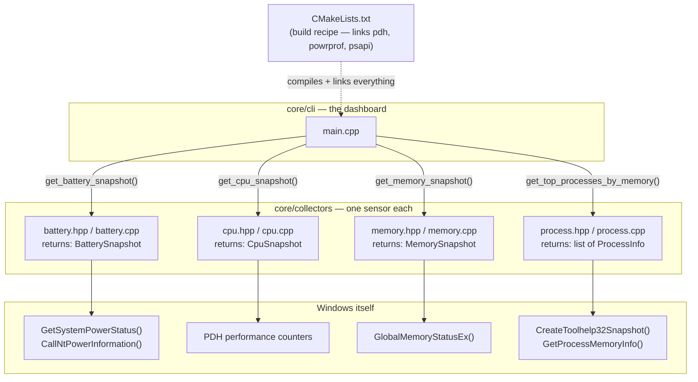

# System Intelligence

An OS-native AI agent for Windows that watches a machine's vitals (battery, CPU, memory, processes...), notices when something looks wrong, investigates the cause, and explains it with evidence — instead of a user having to manually dig through Task Manager, Event Viewer, and `powercfg`.

Full product thinking lives in:
- [`PRD — System Intelligence_ OS-Native AI Diagnostic Agent.md`](PRD%20—%20System%20Intelligence_%20OS-Native%20AI%20Diagnostic%20Agent.md) — what we're building and why
- [`Technical Design — System Intelligence v0.1.md`](Technical%20Design%20—%20System%20Intelligence%20v0.1.md) — how it's architected

## Where things stand right now

This repo currently contains **Step 1 only**: a plain command-line tool that proves we can reliably pull real battery, CPU, memory, and process data straight from Windows — with no AI involved yet. Everything else (history, anomaly detection, the reasoning agent, the native UI) is designed but not built, and will sit on top of this same collector code without needing to change it.

Run it and you get something like:

```text
System Intelligence -- status

Power
  Source          AC
  Charge          88%
  Charge rate     20.7 W

CPU
  Utilization     16.4%

Memory
  Used            11.3 / 15.6 GB  (72%)

Top Processes (by memory)
  Code.exe                464.4 MB
  explorer.exe            456.4 MB
  ...
```

## How the pieces connect



Nothing here talks to Windows directly except the four `collectors/` files — `main.cpp` never touches a Windows API itself, it just asks each collector for its snapshot and prints it. That separation is deliberate: later, the background service and the AI reasoning layer will call these exact same collector functions instead of `main.cpp`, and none of the collector code will need to change.

## What each file does, in easy words

### [`core/collectors/battery.hpp`](core/collectors/battery.hpp)
Just a label — defines a small box called `BatterySnapshot` to carry battery facts around: is there a battery, is it plugged in, what % charge, and how many watts it's charging/draining at. No logic here, just "here's the shape of the data."

### [`core/collectors/battery.cpp`](core/collectors/battery.cpp)
Does the actual work. Calls two Windows functions:
- `GetSystemPowerStatus()` — the simple one: charge %, plugged in or not.
- `CallNtPowerInformation(SystemBatteryState, ...)` — the detailed one: exact wattage.

Gotcha we hit and fixed: Windows stores that wattage in a slot that's technically "can't be negative," but secretly does go negative (for draining) by wrapping around like an odometer rolling backwards. We had to tell the code "treat this as a number that can be negative," otherwise a normal 14-watt drain showed up as "4 million watts."

### [`core/collectors/cpu.hpp`](core/collectors/cpu.hpp) / [`cpu.cpp`](core/collectors/cpu.cpp)
Windows doesn't have a single "CPU % right now" button — it only tracks total time spent working. So this file measures twice, one second apart, and the *difference* between the two readings is the utilization percentage. That's why the tool pauses for about a second while running — it's genuinely waiting to take that second measurement. The tool doing the measuring is called **PDH** (Performance Data Helper), Microsoft's built-in library for exactly this.

### [`core/collectors/memory.hpp`](core/collectors/memory.hpp) / [`memory.cpp`](core/collectors/memory.cpp)
The easy one. `GlobalMemoryStatusEx()` is a single function call that hands back total RAM, available RAM, and a ready-made "% used" number — no waiting or math required.

### [`core/collectors/process.hpp`](core/collectors/process.hpp) / [`process.cpp`](core/collectors/process.cpp)
Three steps:
1. Take a snapshot of every running process (like Task Manager's list) via `CreateToolhelp32Snapshot`.
2. For each one, ask how much memory it's using via `GetProcessMemoryInfo` (some processes refuse this — those get skipped, that's fine).
3. Sort biggest-to-smallest and keep the top 8.

Known simplification: this sorts by **memory**, not CPU. Per-process CPU needs the same "measure twice, one second apart" trick as the CPU collector above, just done individually for every process — left for a follow-up rather than built into this first pass.

### [`core/cli/main.cpp`](core/cli/main.cpp)
The dashboard. Calls all four collectors above and prints the results with some formatting (padding, decimal places) so it reads like a small report instead of raw numbers.

### [`CMakeLists.txt`](CMakeLists.txt)
The build recipe. Tells the compiler:
- which 5 `.cpp` files to compile,
- to use C++20,
- and to link against `pdh`, `powrprof`, `psapi` — Windows' own pre-built libraries containing the real implementations of the functions we called (`PdhOpenQuery`, `CallNtPowerInformation`, `GetProcessMemoryInfo`). Without naming these, the compiler wouldn't know where those functions actually live.

## Building and running it

Requires MSVC (Visual Studio Build Tools with the "Desktop development with C++" workload) and CMake — both come bundled together if you install Build Tools via `winget install Microsoft.VisualStudio.2022.BuildTools --override "--add Microsoft.VisualStudio.Workload.VCTools"`.

```powershell
# from a "Developer Command Prompt" or after running vcvars64.bat
cmake -S . -B build -G "NMake Makefiles" -DCMAKE_BUILD_TYPE=Release
cmake --build build
.\build\sysintel.exe
```

## What's next

Per the technical design's phased plan: add SQLite storage for history (Phase 2), a simple statistics-based anomaly detector for battery drain (Phase 3), then hand these same collectors to a Python reasoning agent as structured tools (Phase 4) — no shell access, no arbitrary commands, just typed function calls like `get_battery_snapshot()`.
