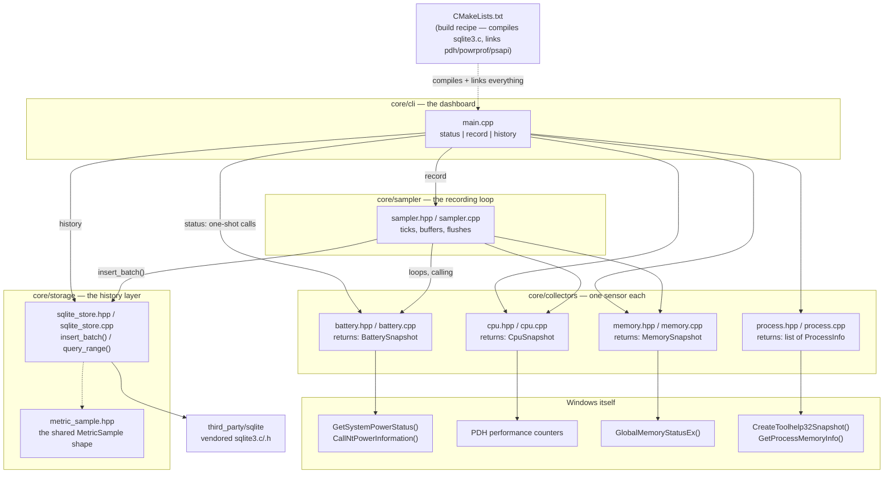

# System Intelligence

An OS-native AI agent for Windows that watches a machine's vitals (battery, CPU, memory, processes...), notices when something looks wrong, investigates the cause, and explains it with evidence — instead of a user having to manually dig through Task Manager, Event Viewer, and `powercfg`.

Full product thinking lives in:
- [`PRD — System Intelligence_ OS-Native AI Diagnostic Agent.md`](PRD%20—%20System%20Intelligence_%20OS-Native%20AI%20Diagnostic%20Agent.md) — what we're building and why
- [`Technical Design — System Intelligence v0.1.md`](Technical%20Design%20—%20System%20Intelligence%20v0.1.md) — how it's architected

## Where things stand right now

This repo currently contains a command-line tool with three jobs, and still no AI involved:

- `sysintel status` — one-shot snapshot (Phase 1: prove we can read real data from Windows)
- `sysintel record` — continuously samples battery/CPU/memory and stores it in SQLite (Phase 2: history)
- `sysintel history <metric> --last <minutes>` — reads back min/avg/max over a time window

Everything else (anomaly detection, the reasoning agent, the native UI) is designed but not built, and will sit on top of this same collector + storage code without needing to change it.

`sysintel status` gives you something like:

```text
System Intelligence -- status

Power
  Source          AC
  Charge          88%
  Charge rate     20.7 W

CPU
  Utilization     16.4%

Memory
  Used            11.3 / 15.6 GB  (72%)

Top Processes (by memory)
  Code.exe                464.4 MB
  explorer.exe            456.4 MB
  ...
```

`sysintel record` runs until Ctrl+C, and `sysintel history cpu.utilization --last 5` then gives you:

```text
cpu.utilization -- last 5 minutes (21 samples)

  Min   7.18
  Avg   13.69
  Max   26.68
```

## How the pieces connect



Nothing here talks to Windows directly except the four `collectors/` files — everything else (`main.cpp`, `sampler.cpp`) just asks a collector for its snapshot. That separation is deliberate: later, the background service and the AI reasoning layer will call these exact same collector functions, and none of the collector code will need to change.

## What each file does, in easy words

### [`core/collectors/battery.hpp`](core/collectors/battery.hpp)
Just a label — defines a small box called `BatterySnapshot` to carry battery facts around: is there a battery, is it plugged in, what % charge, and how many watts it's charging/draining at. No logic here, just "here's the shape of the data."

### [`core/collectors/battery.cpp`](core/collectors/battery.cpp)
Does the actual work. Calls two Windows functions:
- `GetSystemPowerStatus()` — the simple one: charge %, plugged in or not.
- `CallNtPowerInformation(SystemBatteryState, ...)` — the detailed one: exact wattage.

Gotcha we hit and fixed: Windows stores that wattage in a slot that's technically "can't be negative," but secretly does go negative (for draining) by wrapping around like an odometer rolling backwards. We had to tell the code "treat this as a number that can be negative," otherwise a normal 14-watt drain showed up as "4 million watts."

### [`core/collectors/cpu.hpp`](core/collectors/cpu.hpp) / [`cpu.cpp`](core/collectors/cpu.cpp)
Windows doesn't have a single "CPU % right now" button — it only tracks total time spent working. So this file measures twice, one second apart, and the *difference* between the two readings is the utilization percentage. That's why the tool pauses for about a second while running — it's genuinely waiting to take that second measurement. The tool doing the measuring is called **PDH** (Performance Data Helper), Microsoft's built-in library for exactly this.

### [`core/collectors/memory.hpp`](core/collectors/memory.hpp) / [`memory.cpp`](core/collectors/memory.cpp)
The easy one. `GlobalMemoryStatusEx()` is a single function call that hands back total RAM, available RAM, and a ready-made "% used" number — no waiting or math required.

### [`core/collectors/process.hpp`](core/collectors/process.hpp) / [`process.cpp`](core/collectors/process.cpp)
Three steps:
1. Take a snapshot of every running process (like Task Manager's list) via `CreateToolhelp32Snapshot`.
2. For each one, ask how much memory it's using via `GetProcessMemoryInfo` (some processes refuse this — those get skipped, that's fine).
3. Sort biggest-to-smallest and keep the top 8.

Known simplification: this sorts by **memory**, not CPU. Per-process CPU needs the same "measure twice, one second apart" trick as the CPU collector above, just done individually for every process — left for a follow-up rather than built into this first pass.

### [`core/storage/metric_sample.hpp`](core/storage/metric_sample.hpp)
Another label file. Defines `MetricSample` — one universal shape (`metric` name, `value`, `unit`, `timestamp`) that *every* reading gets converted into before it's stored, regardless of which collector produced it. This is a "narrow table" design: one row per reading, so adding a brand-new metric later (GPU, disk, network) never requires changing the database schema — it's just new rows with a new metric name.

### [`core/storage/sqlite_store.hpp`](core/storage/sqlite_store.hpp) / [`sqlite_store.cpp`](core/storage/sqlite_store.cpp)
The history layer. Two jobs:
- `insert_batch(samples)` — writes a whole batch of samples in **one transaction** instead of one write per sample. Every database commit is a disk flush, so batching turns "hundreds of disk flushes" into "one every few seconds" — a big real-world speed difference for basically free.
- `query_range(metric, since, until)` — reads back min/avg/max for one metric over a time window. The database also has exactly one index, on `(metric, timestamp)`, because that's the only kind of question anything in this project actually asks ("show me *this* metric over *this* window").

Runs in "WAL mode," a SQLite setting that lets it survive a crash without corrupting data — worst case, we lose the last few unflushed seconds of samples, never the whole database.

### [`core/sampler/sampler.hpp`](core/sampler/sampler.hpp) / [`sampler.cpp`](core/sampler/sampler.cpp)
The recording loop behind `sysintel record`. Each tick, it checks each metric's own clock — CPU every ~1 second, battery and memory every 5 — collects the due ones, and buffers them in memory. Every 5 seconds it hands the whole buffer to `sqlite_store` in one batch. Ctrl+C sets a stop flag the loop checks each tick, so it exits cleanly and flushes whatever's left in the buffer first.

Known simplification: this is one loop checking everything in turn (round-robin), not one thread per metric. That's fine for a recorder you run from a terminal; the real background service will eventually give each collector its own thread, but that's more machinery than a first storage layer needs.

### [`third_party/sqlite/`](third_party/sqlite)
The SQLite database engine itself — `sqlite3.c` and `sqlite3.h`, downloaded directly from sqlite.org and compiled straight into our program. This is the normal way to use SQLite in a C/C++ project: it's public domain, this is officially how the SQLite team recommends including it, and it avoids needing a package manager just for one dependency.

### [`core/cli/main.cpp`](core/cli/main.cpp)
The dashboard, now with three modes:
- `status` — the original one-shot report (unchanged behavior).
- `record [--db path]` — starts the sampling loop against a SQLite file, runs until Ctrl+C.
- `history <metric> [--last minutes] [--db path]` — reads back stored history and prints min/avg/max.

### [`CMakeLists.txt`](CMakeLists.txt)
The build recipe. Tells the compiler:
- which `.cpp` files to compile (collectors, storage, sampler, CLI) plus `sqlite3.c` as a C file,
- to use C++20 for our own code,
- where to find `sqlite3.h` (`third_party/sqlite`),
- and to link against `pdh`, `powrprof`, `psapi` — Windows' own pre-built libraries containing the real implementations of the functions we called (`PdhOpenQuery`, `CallNtPowerInformation`, `GetProcessMemoryInfo`). Without naming these, the compiler wouldn't know where those functions actually live.

## Building and running it

Requires MSVC (Visual Studio Build Tools with the "Desktop development with C++" workload) and CMake — both come bundled together if you install Build Tools via `winget install Microsoft.VisualStudio.2022.BuildTools --override "--add Microsoft.VisualStudio.Workload.VCTools"`.

```powershell
# from a "Developer Command Prompt" or after running vcvars64.bat
cmake -S . -B build -G "NMake Makefiles" -DCMAKE_BUILD_TYPE=Release
cmake --build build

.\build\sysintel.exe status
.\build\sysintel.exe record --db sysintel.db          # Ctrl+C to stop
.\build\sysintel.exe history cpu.utilization --last 30 --db sysintel.db
```

## What's next

Per the technical design's phased plan, next up is a simple statistics-based anomaly detector for battery drain (Phase 3) built on top of this history — flag a reading as abnormal if it's well outside the mean/std-dev of recent samples. After that, these same collectors get handed to a Python reasoning agent as structured tools (Phase 4) — no shell access, no arbitrary commands, just typed function calls like `get_battery_snapshot()`.

Deliberately deferred for now: retention/rollup (the plan is to collapse raw samples older than 24h into 1-minute aggregates and keep those for 30 days, per the tech design) — not needed until the database has actually been running long enough for it to matter.
