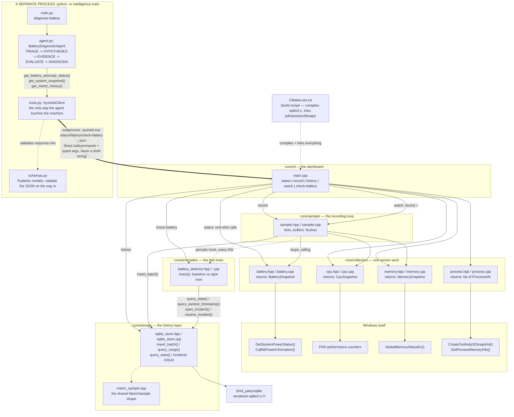
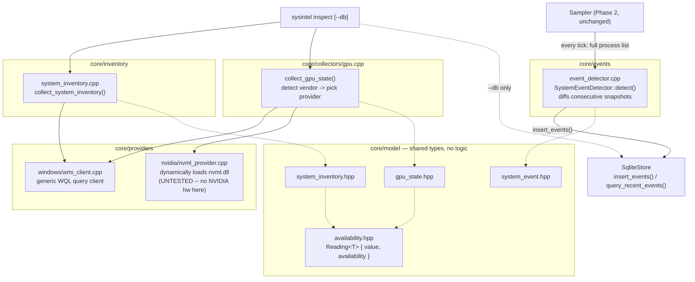

# System Intelligence

An OS-native AI agent for Windows that watches a machine's vitals (battery, CPU, memory, processes...), notices when something looks wrong, investigates the cause, and explains it with evidence — instead of a user having to manually dig through Task Manager, Event Viewer, and `powercfg`.

Full product thinking lives in:
- [`PRD — System Intelligence_ OS-Native AI Diagnostic Agent.md`](PRD%20—%20System%20Intelligence_%20OS-Native%20AI%20Diagnostic%20Agent.md) — what we're building and why
- [`Technical Design — System Intelligence v0.1.md`](Technical%20Design%20—%20System%20Intelligence%20v0.1.md) — how it's architected

## Where things stand right now

This repo now spans two runtimes:

**A C++ CLI** (`core/`, still no AI involved — everything here is plain statistics, not a model):
- `sysintel status` — one-shot snapshot (Phase 1: prove we can read real data from Windows)
- `sysintel record` — continuously samples battery/CPU/memory and stores it in SQLite (Phase 2: history)
- `sysintel history <metric> --last <minutes>` — reads back min/avg/max over a time window
- `sysintel check-battery` — runs one battery-drain anomaly check right now and prints the result (Phase 3)
- `sysintel watch` — `record` plus a battery anomaly check every 60 seconds, in one long-running loop (Phase 3)
- `sysintel inspect [--db path]` — one unified snapshot: hardware inventory, live GPU state, and (with `--db`) recent events (Phase 3.5)
- `sysintel events [--last minutes]` — process start/stop and AC connect/disconnect events, synthesized from the recorder without needing ETW
- every command above also takes `--json` for machine-readable output

**A Python reasoning agent** (`intelligence/`, Phase 4 — the first AI-shaped piece, though not actually calling a model yet, see below):
- `diagnose-battery` — investigates an open battery incident: collects evidence via the CLI's `--json` output, weighs it against a small set of hypotheses, and prints an evidence-based diagnosis in the PRD's Finding/Confidence/Evidence/Alternatives/Recommendation format

Everything else (the native UI, AMD/Intel GPU telemetry, an actual LLM call) is designed but not built, and will sit on top of this same collector + storage + detector + tool-client code without needing to change it.

### Phase 3.5: a Unified System Model

Rather than the agent eventually needing dozens of scattered tools (`get_cpu()`, `get_gpu()`, `get_fans()`, ...), this phase reorganizes what we collect into four named pillars:

| Pillar | What it is | Where it lives |
|---|---|---|
| **Inventory** | Things that rarely change: CPU/GPU/disk model, OS version, battery chemistry | `core/inventory/`, refreshed on demand |
| **State** | Things that change constantly: current battery/CPU/memory/GPU readings | `core/collectors/`, already existed since Phase 1 |
| **History** | State over time | SQLite, already existed since Phase 2 |
| **Events** | Discrete "something changed" facts: a process started, AC got unplugged | `core/events/`, new this phase |

The other new piece is an **availability-aware value type**. A bare `0` or `null` is ambiguous — does a fan reading of `0` mean the fan is off, or that this laptop just doesn't expose fan telemetry at all? Every new reading in this phase is a `Reading<T>`, which carries both a value *and* one of `ok` / `unsupported` / `unavailable` / `error`, so the difference is never lost.

`sysintel status` gives you something like:

```text
System Intelligence -- status

Power
  Source          AC
  Charge          88%
  Charge rate     20.7 W

CPU
  Utilization     16.4%

Memory
  Used            11.3 / 15.6 GB  (72%)

Top Processes (by memory)
  Code.exe                464.4 MB
  explorer.exe            456.4 MB
  ...
```

`sysintel record` runs until Ctrl+C, and `sysintel history cpu.utilization --last 5` then gives you:

```text
cpu.utilization -- last 5 minutes (21 samples)

  Min   7.18
  Avg   13.69
  Max   26.68
```

And `sysintel check-battery` — once there's at least 14 days of accumulated battery history (configurable with `--min-history-days`, mainly for testing) — gives you one of:

```text
Not enough history yet to evaluate battery anomalies.
```
```text
Battery normal. Baseline 8.4W (+/-1.5W)
```
```text
ANOMALY DETECTED: battery-1789471660271
  Observed  21.9 W
  Baseline  8.4 W
  Threshold 15.4 W
```

And once there's an open incident, `python -m intelligence.main diagnose-battery` investigates it:

```text
Finding
  System-wide CPU workload is responsible

Confidence: 70%

Evidence
  - Battery discharge: 21.9W observed vs 8.4W baseline (threshold 15.4W)
  - CPU utilization: 75.9% now vs 23.6% (24h average)
  - Top processes by memory: msedge.exe (625 MB), Code.exe (378 MB), Code.exe (355 MB)

Alternative explanations
  - Unexplained by anything this build can currently measure (likely GPU activity or a driver regression -- no collector for either yet)

Recommended action
  Investigate which process is driving CPU usage; consider closing it or switching to a lower power plan.

Risk
  low -- this is a diagnosis only, no action was taken

Expected result
  Battery discharge should return toward the 8.4W baseline.
```

`sysintel inspect` pulls inventory + live GPU state (and, with `--db`, recent events) into one screen:

```text
====== SYSTEM INTELLIGENCE: inspect ======

SYSTEM
  Manufacturer    Dell Inc.
  Model           XPS 9315
  OS              Microsoft Windows 11 Home Single Language

CPU
  Model           12th Gen Intel(R) Core(TM) i7-1250U
  Cores           10
  Threads         12

GPU
  [0] Intel -- Intel(R) Iris(R) Xe Graphics
      VRAM            2048 MB

GPU STATE (live)
  [0] Intel -- Intel(R) Iris(R) Xe Graphics
      Utilization unsupported
      VRAM            unsupported
      Temperature unsupported
      Power (W)   unsupported
      P-State     unsupported

MEMORY
  DIMMs           8
  Total           16 GB

BATTERY
  Chemistry       Unknown
  Design cap.     unavailable
  Full charge     unavailable

RECENT EVENTS
  1789473073420  process.started  pid=16948  name=conhost.exe
  1789473062157  process.stopped  pid=3080  name=Notepad.exe
  1789473053951  power.ac_disconnected

===========================================
```

Every `unsupported` above is real, verified behavior on this dev machine (an Intel-only laptop) — not a placeholder. That's the whole point of the availability-aware `Reading<T>` type: this machine's GPU genuinely doesn't expose utilization/temperature/power through any provider this project has (yet), and the output says so explicitly instead of printing a misleading `0`.

When CPU is normal too, it says exactly that instead of guessing:

```text
Finding
  Unexplained by anything this build can currently measure (likely GPU activity or a driver regression -- no collector for either yet)

Confidence: 60%
```

## How the pieces connect



Nothing here talks to Windows directly except the four `collectors/` files — everything else (`main.cpp`, `sampler.cpp`) just asks a collector for its snapshot. That separation is deliberate: later, the background service and the AI reasoning layer will call these exact same collector functions, and none of the collector code will need to change.

Notice the `python -m intelligence.main` box is a **separate process**, connected to everything above it by exactly one edge: `tools.py` calling `sysintel.exe` as a subprocess with fixed subcommands (`status`, `history`, `check-battery`) and typed arguments — never a free-form string handed to a shell. That's the whole point of the boundary: the reasoning layer can be wrong, slow, or (eventually) an actual LLM making mistakes, and none of that can turn into an arbitrary command against the machine. The real product will eventually replace this subprocess+JSON transport with the named-pipe IPC from the tech design, but the *tools* the agent calls won't need to change — only what's underneath them.

### Phase 3.5's additions: Inventory, Events, and GPU dispatch

This is a separate diagram rather than folding into the one above, since cramming both in would make neither legible.



## What each file does, in easy words

### [`core/collectors/battery.hpp`](core/collectors/battery.hpp)
Just a label — defines a small box called `BatterySnapshot` to carry battery facts around: is there a battery, is it plugged in, what % charge, and how many watts it's charging/draining at. No logic here, just "here's the shape of the data."

### [`core/collectors/battery.cpp`](core/collectors/battery.cpp)
Does the actual work. Calls two Windows functions:
- `GetSystemPowerStatus()` — the simple one: charge %, plugged in or not.
- `CallNtPowerInformation(SystemBatteryState, ...)` — the detailed one: exact wattage.

Gotcha we hit and fixed: Windows stores that wattage in a slot that's technically "can't be negative," but secretly does go negative (for draining) by wrapping around like an odometer rolling backwards. We had to tell the code "treat this as a number that can be negative," otherwise a normal 14-watt drain showed up as "4 million watts."

### [`core/collectors/cpu.hpp`](core/collectors/cpu.hpp) / [`cpu.cpp`](core/collectors/cpu.cpp)
Windows doesn't have a single "CPU % right now" button — it only tracks total time spent working. So this file measures twice, one second apart, and the *difference* between the two readings is the utilization percentage. That's why the tool pauses for about a second while running — it's genuinely waiting to take that second measurement. The tool doing the measuring is called **PDH** (Performance Data Helper), Microsoft's built-in library for exactly this.

### [`core/collectors/memory.hpp`](core/collectors/memory.hpp) / [`memory.cpp`](core/collectors/memory.cpp)
The easy one. `GlobalMemoryStatusEx()` is a single function call that hands back total RAM, available RAM, and a ready-made "% used" number — no waiting or math required.

### [`core/collectors/process.hpp`](core/collectors/process.hpp) / [`process.cpp`](core/collectors/process.cpp)
Three steps:
1. Take a snapshot of every running process (like Task Manager's list) via `CreateToolhelp32Snapshot`.
2. For each one, ask how much memory it's using via `GetProcessMemoryInfo` (some processes refuse this — those get skipped, that's fine).
3. Sort biggest-to-smallest and keep the top 8.

Known simplification: this sorts by **memory**, not CPU. Per-process CPU needs the same "measure twice, one second apart" trick as the CPU collector above, just done individually for every process — left for a follow-up rather than built into this first pass.

It also exposes `get_all_process_identities()` — every PID+name with *no* memory query, cheap enough to call every ~1 second purely so the event detector below can diff it against the last tick.

### [`core/model/availability.hpp`](core/model/availability.hpp)
The foundational addition this phase: `Reading<T>` pairs a value with one of four states — `ok`, `unsupported` (this hardware/vendor genuinely doesn't expose it), `unavailable` (should be readable, but this particular query failed), or `error`. Every new collector from this phase on returns `Reading<T>` fields instead of a bare number, so "the fan is off" and "we have no idea if there's even a fan" are never confused with each other.

### [`core/model/system_inventory.hpp`](core/model/system_inventory.hpp) / [`core/inventory/system_inventory.cpp`](core/inventory/system_inventory.cpp)
The "things that don't change often" pillar — CPU/GPU/disk model, OS version, memory DIMM count, battery chemistry. Implemented via WMI (`Win32_Processor`, `Win32_VideoController`, `Win32_OperatingSystem`, `Win32_PhysicalMemory`, `Win32_DiskDrive`, `Win32_Battery`) — the first time this codebase queries WMI rather than raw Win32/PDH. `Win32_Battery`'s `DesignCapacity`/`FullChargeCapacity` come back genuinely empty on this dev machine's OEM controller, which is exactly the real-world case the availability type exists for: the battery *is* there (so it's not "unsupported"), the fields are just unpopulated (so it's "unavailable").

### [`core/providers/windows/wmi_client.hpp`](core/providers/windows/wmi_client.hpp) / [`wmi_client.cpp`](core/providers/windows/wmi_client.cpp)
A small reusable wrapper around WMI's COM API (`IWbemLocator`, `IWbemServices`, SAFEARRAYs of property names, VARIANTs...) so every inventory field doesn't have to repeat that boilerplate. Give it a WQL string, get back plain string-keyed rows. If WMI itself is unreachable (e.g. the service is disabled), `ok()` is false and every query just returns empty rather than crashing — callers treat that the same way they treat a missing field.

### [`core/model/gpu_state.hpp`](core/model/gpu_state.hpp) / [`core/collectors/gpu.cpp`](core/collectors/gpu.cpp)
The vendor-dispatch pattern: detect each GPU's vendor via WMI (same source the inventory uses), then hand NVIDIA adapters to the NVML provider and mark AMD/Intel adapters `unsupported` (no provider built for either yet). If WMI says there's an NVIDIA GPU but NVML couldn't be loaded, that's reported as `unavailable`, not `unsupported` — the hardware path exists, the telemetry provider just isn't reachable right now. This distinction is only meaningful because of the availability type above.

### [`core/providers/nvidia/nvml_min.hpp`](core/providers/nvidia/nvml_min.hpp) / [`nvml_provider.hpp`](core/providers/nvidia/nvml_provider.hpp) / [`nvml_provider.cpp`](core/providers/nvidia/nvml_provider.cpp)
GPU utilization/VRAM/temperature/power/performance-state for NVIDIA GPUs, via NVIDIA's NVML. Rather than linking a static import lib (which requires the CUDA Toolkit as a build dependency — not something an end user's machine would have), this hand-declares the small stable subset of NVML's C ABI it needs and loads `nvml.dll` dynamically with `LoadLibrary`/`GetProcAddress` at runtime. That's also exactly why the project still compiles and runs cleanly here: this dev machine has only an Intel iGPU, `nvml.dll` doesn't exist on it, `LoadLibraryA` returns null, and every GPU reading correctly falls back to `unavailable`/`unsupported` instead of failing to build.

**Caveat, stated plainly:** this was written without access to NVIDIA hardware. The dynamic-loading mechanism and struct layouts follow NVIDIA's publicly documented, stable NVML ABI, and the negative path (no `nvml.dll` present) is verified working — but the actual "read real GPU telemetry" path has not been exercised against a real device or driver. Verify on NVIDIA hardware before relying on it.

### [`core/model/system_event.hpp`](core/model/system_event.hpp) / [`core/events/event_detector.hpp`](core/events/event_detector.hpp) / [`event_detector.cpp`](core/events/event_detector.cpp)
The "what changed" pillar — without needing ETW yet. `SystemEventDetector` keeps the previous tick's full PID set and AC-power state; each call diffs the new snapshot against it and returns `process.started`/`process.stopped`/`power.ac_connected`/`power.ac_disconnected` events for whatever changed. True ETW-based tracking (lower latency, catches processes that start and exit *between* poll ticks) is a real upgrade for later, not needed to get real event data today — verified by launching and closing Notepad mid-recording and seeing both events land in SQLite.

### [`core/storage/metric_sample.hpp`](core/storage/metric_sample.hpp)
Another label file. Defines `MetricSample` — one universal shape (`metric` name, `value`, `unit`, `timestamp`) that *every* reading gets converted into before it's stored, regardless of which collector produced it. This is a "narrow table" design: one row per reading, so adding a brand-new metric later (GPU, disk, network) never requires changing the database schema — it's just new rows with a new metric name.

### [`core/storage/sqlite_store.hpp`](core/storage/sqlite_store.hpp) / [`sqlite_store.cpp`](core/storage/sqlite_store.cpp)
The history layer. Jobs:
- `insert_batch(samples)` — writes a whole batch of samples in **one transaction** instead of one write per sample. Every database commit is a disk flush, so batching turns "hundreds of disk flushes" into "one every few seconds" — a big real-world speed difference for basically free.
- `query_range(metric, since, until)` — reads back min/avg/max for one metric over a time window.
- `query_stats(metric, since, until)` — reads back mean/standard-deviation instead, which is what the anomaly detector actually needs. It computes this with one `AVG`/`AVG(x*x)` SQL query rather than pulling every row back and computing it in C++.
- `query_earliest_timestamp(metric)` — how far back a metric's history actually goes, used to gate anomaly evaluation until there's enough of it.
- `open_incident()` / `get_open_incident()` / `resolve_incident()` — a tiny incident lifecycle: at most one *open* incident per domain at a time, so a persistent anomaly doesn't spam a new incident every check.
- `insert_events(events)` / `query_recent_events(since, limit)` — the events pillar's storage, batched into the same transaction pattern as metric samples since they're produced by the same tick.

The database also has exactly one index on `metric_samples`, on `(metric, timestamp)`; one on `incidents`, on `(domain, status)`; and one on `system_events`, on `(timestamp)` — all three built from the actual questions this project asks, not defensively.

Runs in "WAL mode," a SQLite setting that lets it survive a crash without corrupting data — worst case, we lose the last few unflushed seconds of samples, never the whole database.

### [`core/sampler/sampler.hpp`](core/sampler/sampler.hpp) / [`sampler.cpp`](core/sampler/sampler.cpp)
The recording loop behind `sysintel record`. Each tick, it checks each metric's own clock — CPU every ~1 second, battery and memory every 5 — collects the due ones, and buffers them in memory. Every 5 seconds it hands the whole buffer to `sqlite_store` in one batch. Ctrl+C sets a stop flag the loop checks each tick, so it exits cleanly and flushes whatever's left in the buffer first.

Known simplification: this is one loop checking everything in turn (round-robin), not one thread per metric. That's fine for a recorder you run from a terminal; the real background service will eventually give each collector its own thread, but that's more machinery than a first storage layer needs.

It also supports one optional extra: `set_periodic_hook(interval, callback)` lets a caller run something else on a schedule (right now, an anomaly check) without `Sampler` needing to know or care what that something is — it just calls whatever function it was handed, on schedule. That's how `watch` reuses the exact same recording loop as `record`, just with one more thing plugged in.

Since this phase, it also calls `get_all_process_identities()` every tick and hands the result to a `SystemEventDetector`, buffering and flushing whatever events come back the same way it does metric samples.

### [`core/util/json.hpp`](core/util/json.hpp)
The `json_escape`/`json_num` helpers, factored out once both `main.cpp`'s `--json` output and `sqlite_store.cpp`'s event-payload serialization needed the same small bit of string-escaping logic — better shared once than copied twice.

### [`core/anomalies/battery_detector.hpp`](core/anomalies/battery_detector.hpp) / [`battery_detector.cpp`](core/anomalies/battery_detector.cpp)
The "fast brain" for battery drain — no AI, just arithmetic on stored history. Each `check()` call:
1. **Gate:** refuses to evaluate anything until history for `battery.discharge_watts` goes back at least `min_history_days` (14 by default, as requested) *and* has at least `min_baseline_samples` actual readings in that window — a technically-old-enough database that's mostly empty still won't trigger.
2. **Baseline:** mean + standard deviation of discharge wattage over that same trailing window.
3. **Right now:** mean discharge wattage over the last 5 minutes.
4. **Rule:** flag an anomaly if "right now" exceeds `max(baseline_mean + 2.5·stddev, baseline_mean·1.5)` — whichever is the more forgiving of the two, so a very quiet, low-variance baseline doesn't get flagged by trivially small bumps.
5. **Incident lifecycle:** opens one incident on first detection, recognizes it's already open on every subsequent check (no duplicate spam), and resolves it once discharge drops comfortably back near baseline (a deliberate hysteresis gap, so a reading right at the edge doesn't flip open/resolved on every check).

Because there are no recent `battery.discharge_watts` rows at all while a laptop is plugged in (the sampler only emits that metric while actually discharging — see `sampler.cpp` above), "no recent discharge samples" doubles as "we're on AC right now," with no separate flag needed.

### [`third_party/sqlite/`](third_party/sqlite)
The SQLite database engine itself — `sqlite3.c` and `sqlite3.h`, downloaded directly from sqlite.org and compiled straight into our program. This is the normal way to use SQLite in a C/C++ project: it's public domain, this is officially how the SQLite team recommends including it, and it avoids needing a package manager just for one dependency.

### [`core/cli/main.cpp`](core/cli/main.cpp)
The dashboard, now with seven modes (`status`, `history`, `check-battery`, `watch` also accept `--json`):
- `status [--json]` — the original one-shot report (unchanged behavior).
- `record [--db path]` — starts the sampling loop against a SQLite file, runs until Ctrl+C.
- `history <metric> [--last minutes] [--db path]` — reads back stored history and prints min/avg/max.
- `check-battery [--db path] [--min-history-days n]` — runs one battery anomaly check right now.
- `watch [--db path] [--min-history-days n]` — `record`, plus a battery anomaly check every 60 seconds, in one loop.
- `inspect [--db path]` — inventory + live GPU state + (with `--db`) recent events, all on one screen.
- `events [--last minutes] [--limit n] [--db path]` — recent process/power events.

The `--json` output uses the hand-written helpers in `core/util/json.hpp`, not a JSON library — the object shapes here are small and fixed, so a real library would be machinery this project doesn't need yet, the same call made about not vendoring a package manager just for SQLite. This JSON is the entire contract the Python agent depends on.

### [`intelligence/schemas.py`](intelligence/schemas.py)
Pydantic models that mirror the CLI's JSON output exactly — `BatterySnapshot`, `SystemSnapshot`, `MetricHistory`, `Incident`, `BatteryCheckReport`. Pydantic validates the shape on the way in, so if the C++ side's JSON ever drifts (a renamed field, a missing key), it fails loudly right here instead of as a confusing bug three layers into the agent's reasoning.

### [`intelligence/tools.py`](intelligence/tools.py)
The agent's *only* way of touching the machine — this is literally the PRD's "Diagnostic Tool Interface." `SysIntelClient` exposes exactly three methods (`get_system_snapshot`, `get_metric_history`, `get_battery_anomaly_status`), each calling one fixed `sysintel.exe` subcommand via `subprocess.run` with a list of arguments — never a shell string. There is no method on this class that could execute an arbitrary command; the agent literally cannot construct one.

### [`intelligence/agent.py`](intelligence/agent.py)
The reasoning loop: TRIAGE → GENERATE HYPOTHESES → COLLECT EVIDENCE → EVALUATE → DIAGNOSIS. `BatteryDiagnosticAgent.diagnose()`:
1. Checks whether there's actually an open battery incident (TRIAGE) — bails out honestly if not, or if there isn't enough history yet.
2. Considers exactly two hypotheses: "CPU workload explains it" (H1) or "unexplained by anything we can currently measure" (H2).
3. Pulls CPU history (24h baseline vs last 5 minutes) and the current process list as evidence.
4. If recent CPU is well above its normal baseline, H1 wins with real supporting evidence attached; otherwise H2 wins, explicitly naming what's missing (GPU, driver history) rather than guessing.
5. Returns a `Diagnosis` in the PRD's format: Finding / Confidence / Evidence / Alternative explanations / Recommended action / Risk / Expected result.

This is deliberately **rule-based, not an LLM call** — with only two real hypotheses currently wired into this agent, a fixed rule set is honest and sufficient. A GPU collector now exists at the C++ layer (Phase 3.5) but isn't plumbed into `tools.py`/`schemas.py` yet, so this agent still can't see it; that plumbing plus a third real hypothesis is exactly where an actual model call starts earning its keep over the current rule-based step.

### [`intelligence/main.py`](intelligence/main.py)
The Python entry point — `python -m intelligence.main diagnose-battery [--db path] [--sysintel-exe path] [--min-history-days n]`. Wires a `SysIntelClient` to a `BatteryDiagnosticAgent` and prints the resulting diagnosis.

### [`intelligence/requirements.txt`](intelligence/requirements.txt)
Just `pydantic`. Installed into its own virtual environment (`intelligence/.venv`, gitignored) rather than system-wide — keeps this project's dependencies from colliding with anything else on the machine.

### [`CMakeLists.txt`](CMakeLists.txt)
The build recipe. Tells the compiler:
- which `.cpp` files to compile (collectors, storage, sampler, anomaly detector, inventory, events, GPU dispatch, WMI/NVML providers, CLI) plus `sqlite3.c` as a C file,
- to use C++20 for our own code,
- where to find `sqlite3.h` (`third_party/sqlite`),
- and to link against `pdh`, `powrprof`, `psapi`, `wbemuuid` (the last for WMI's COM API) — Windows' own pre-built libraries containing the real implementations of the functions we called. Without naming these, the compiler wouldn't know where those functions actually live. NVML needs no new link library at all, since it's loaded dynamically at runtime with `LoadLibrary` rather than linked at build time.

## Building and running it

Requires MSVC (Visual Studio Build Tools with the "Desktop development with C++" workload) and CMake — both come bundled together if you install Build Tools via `winget install Microsoft.VisualStudio.2022.BuildTools --override "--add Microsoft.VisualStudio.Workload.VCTools"`.

```powershell
# from a "Developer Command Prompt" or after running vcvars64.bat
cmake -S . -B build -G "NMake Makefiles" -DCMAKE_BUILD_TYPE=Release
cmake --build build

.\build\sysintel.exe status
.\build\sysintel.exe record --db sysintel.db          # Ctrl+C to stop
.\build\sysintel.exe history cpu.utilization --last 30 --db sysintel.db
.\build\sysintel.exe watch --db sysintel.db           # records + checks battery every 60s, Ctrl+C to stop
.\build\sysintel.exe check-battery --db sysintel.db   # one-shot anomaly check
.\build\sysintel.exe inspect --db sysintel.db         # inventory + live GPU state + recent events
.\build\sysintel.exe events --last 30 --db sysintel.db
```

Battery anomaly checks require at least 14 days of accumulated `record`/`watch` history by default before they'll evaluate anything — pass `--min-history-days <n>` to override this for local testing against a shorter or synthetic dataset.

The Python agent needs its own one-time setup:

```powershell
python -m venv intelligence\.venv
intelligence\.venv\Scripts\pip install -r intelligence\requirements.txt

# once there's an open incident in the database (see `check-battery` above):
intelligence\.venv\Scripts\python -m intelligence.main diagnose-battery --db sysintel.db --sysintel-exe build\sysintel.exe
```

## What's next

The Phase 4 reasoning loop still doesn't see any of what Phase 3.5 just added — `tools.py`/`schemas.py` only expose battery/CPU/memory/process data, not GPU state or events. Wiring that in (extend `status --json` with a `gpu` field, add `get_recent_events()` to `SysIntelClient`, give the agent a real third hypothesis to weigh) is the natural next step, and it's also the point where a real LLM call starts earning its keep over the current rule-based hypothesis step — three-plus competing, evidence-backed hypotheses is where a fixed rule set stops being the honest choice.

The NVML path specifically needs verification on real NVIDIA hardware before it's trustworthy — everything that could be checked without that hardware (the dynamic-loading fallback, vendor dispatch, WMI-based inventory) has been.

Also still deliberately deferred: AMD/Intel GPU providers (currently always `unsupported`), true ETW-based event tracking (current events are polling-diffed, which misses anything that starts and exits between ~1s ticks), and retention/rollup (collapse raw samples older than 24h into 1-minute aggregates, keep those for 30 days, per the tech design) — not needed until the database has actually been running long enough for it to matter.
