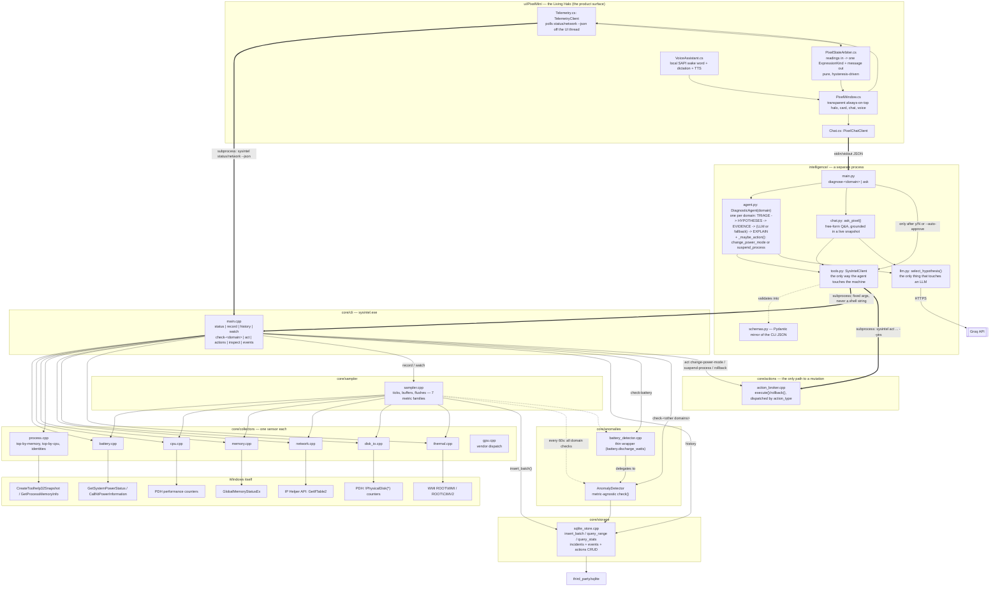

# System Intelligence — System Documentation

Technical reference for the codebase: architecture, components, data model,
CLI reference, build/run instructions, and known limitations. For the
product pitch, see [README.md](README.md). For the underlying product
thinking, see [`PRD — System Intelligence_ OS-Native AI Diagnostic Agent.md`](PRD%20—%20System%20Intelligence_%20OS-Native%20AI%20Diagnostic%20Agent.md)
and [`Technical Design — System Intelligence v0.1.md`](Technical%20Design%20—%20System%20Intelligence%20v0.1.md).
For the Living Halo UI's implementation state and next steps, see
[UI_HANDOFF.md](UI_HANDOFF.md) — that file is the live handoff document for
continuing UI work and is kept more current than this one on UI specifics.

## Overview

System Intelligence is three cooperating pieces that share one SQLite
database and one process boundary model — nothing above the C++ layer can
touch the machine directly:

1. **`core/` — a C++ CLI (`sysintel.exe`).** No AI. Plain Win32/WMI/PDH calls
   and arithmetic. Collects live hardware state, records history to SQLite,
   detects statistical anomalies, and is the only thing in the codebase that
   can mutate machine state (via an explicit, audited Action Broker).
2. **`intelligence/` — a Python reasoning agent.** Talks to `sysintel.exe`
   exclusively via `subprocess` calls with fixed, typed arguments — never a
   shell string. Turns deterministic evidence into an LLM-backed (Groq)
   diagnosis with a rule-based fallback, and answers free-form chat questions
   the same disciplined way.
3. **`ui/PixelMini/` — the Living Halo, a native WPF desktop presence.** The
   actual product surface. Polls the C++ CLI's JSON output, drives a small
   deterministic state arbiter, and renders an ambient light rather than a
   dashboard. Users are not expected to know the CLI, the database, or the
   Python agent exist.

Everything downstream of a collector only ever reads what the collector
already produced; nothing bypasses it to query Windows directly. Everything
downstream of the Action Broker (Python, the UI) only ever *proposes* an
action — the broker is the sole path to an actual mutation, and it is not
reachable from the LLM.

## Repository layout

| Path | What it is |
|---|---|
| `core/cli/` | `main.cpp` — the `sysintel` command dispatcher |
| `core/collectors/` | One file per hardware domain: battery, cpu, memory, process, network, disk_io, thermal, gpu |
| `core/model/` | Shared data shapes, no logic (`Reading<T>`, snapshots, inventory, events) |
| `core/inventory/` | Static, rarely-changing hardware facts, via WMI |
| `core/events/` | Process start/stop and AC connect/disconnect, diffed from consecutive snapshots |
| `core/providers/windows/` | Generic WMI query client |
| `core/providers/nvidia/` | NVML-based NVIDIA GPU telemetry, dynamically loaded |
| `core/anomalies/` | The metric-agnostic `AnomalyDetector`, plus the battery-specific wrapper |
| `core/actions/` | The Action Broker, power-scheme control, process suspend/resume |
| `core/sampler/` | The recording loop behind `record`/`watch` |
| `core/storage/` | SQLite persistence layer |
| `core/util/` | Small shared helpers (JSON escaping, string case) |
| `third_party/sqlite/` | Vendored SQLite (`sqlite3.c`/`.h`) |
| `intelligence/` | The Python diagnostic agent, chat, and LLM boundary |
| `ui/PixelMini/` | The Living Halo WPF desktop companion (the shipped UI direction) |
| `ui/GlowPrototype/` | Retained design history only — not the current implementation |
| `CMakeLists.txt` | Build recipe for `sysintel.exe` |

## Architecture



Nothing outside `core/collectors/` talks to Windows directly — `main.cpp`
and `sampler.cpp` only ever ask a collector for its snapshot. The Python
process is a hard boundary: `tools.py` is the *only* thing that shells out to
`sysintel.exe`, always with fixed subcommands and typed arguments, never a
free-form string. The LLM (`llm.py`, `chat.py`) never touches the machine —
it only reasons over evidence `agent.py`/`chat.py` already gathered
deterministically, and any action it proposes is re-validated in plain code
before it can run.

## Components

### `core/model` — the availability-aware value type

`Reading<T>` (`core/model/availability.hpp`) pairs a value with one of four
states: `ok`, `unsupported` (this hardware/vendor genuinely doesn't expose
it), `unavailable` (should be readable, but this query failed right now), or
`error`. Every collector built since the initial CPU/memory/battery pass
returns `Reading<T>` fields rather than a bare number, so "the fan is off"
and "we have no idea if there's a fan" are never confused. `schemas.py`
mirrors this field-for-field, so the distinction survives the C++ → JSON →
Python round trip intact, and the UI renders an unavailable reading as
`n/a`/`—`, never a fabricated zero.

### `core/collectors` — one sensor per hardware domain

| Collector | Windows API | Notes |
|---|---|---|
| `battery.cpp` | `GetSystemPowerStatus`, `CallNtPowerInformation(SystemBatteryState)` | Discharge wattage is stored in an unsigned slot that wraps like an odometer when negative (draining); must be reinterpreted as signed or a 14W drain reads as millions of watts. |
| `cpu.cpp` | PDH | No single "CPU % now" API exists — two samples one second apart, the difference is the utilization. This is why CLI calls that touch CPU pause briefly. |
| `memory.cpp` | `GlobalMemoryStatusEx` | One call, no waiting. |
| `process.cpp` | `CreateToolhelp32Snapshot`, `GetProcessMemoryInfo`, PDH `\Process(*)\% Processor Time` | Top-by-memory and top-by-cpu process lists, plus a cheap all-identities call used by the event detector. Matching the CPU-time and PID counters by instance *name* is approximate — two same-named instances can resolve to the same PID (a known PDH ordering quirk), not something this code hides. |
| `network.cpp` | IP Helper API `GetIfTable2`, WLAN API | Filters to `HardwareInterface && !FilterInterface` — without it, one physical Wi-Fi card reports as ~25 rows (one per internal NDIS filter driver sharing its interface type). Requires `ws2def.h`/`ws2ipdef.h` included before `windows.h` for `GetIfTable2` to even declare. Wi-Fi signal quality is best-effort (WLAN API reports on whichever interface is *connected*, not addressable per-adapter). |
| `disk_io.cpp` | PDH `\PhysicalDisk(*)` | Read/write throughput, IOPS, queue length per physical disk; reuses the two-sample-rate trick from `cpu.cpp`. |
| `thermal.cpp` | WMI `MSAcpi_ThermalZoneTemperature` (`ROOT\WMI`), `Win32_Fan` (`ROOT\CIMV2`) | The `WmiClient` constructor takes an optional namespace specifically for this — every other WMI query in the project lives in `ROOT\CIMV2`. OEM fragmentation is real and expected: on the reference dev machine, thermal zones report `unsupported` and the one `Win32_Fan` instance reports `unavailable` for its speed field. |
| `gpu.cpp` | WMI (vendor detection) + `core/providers/` | Detects vendor via WMI, then dispatches: NVIDIA → NVML provider, AMD/Intel → `unsupported` (no provider built). If WMI reports an NVIDIA GPU but NVML can't load, that's `unavailable`, not `unsupported` — the hardware path exists, the telemetry provider just isn't reachable. |

`core/providers/nvidia/nvml_provider.cpp` loads `nvml.dll` dynamically
(`LoadLibrary`/`GetProcAddress`) against a hand-declared subset of NVML's
stable C ABI, specifically to avoid requiring the CUDA Toolkit as a build
dependency. **This path has never been exercised against real NVIDIA
hardware or driver** — the negative path (no `nvml.dll` present) is
verified; the actual telemetry-read path is not. A known fix is in place for
`nvmlDeviceGetComputeRunningProcesses_v3`: it now retries once with a
correctly-sized buffer on `NVML_ERROR_INSUFFICIENT_SIZE` instead of silently
dropping every process when the initial fixed-size (64-process) buffer is
too small — but this fix itself is code-review-verified only, not
hardware-verified. Verify on NVIDIA hardware before relying on it.

### `core/inventory` and `core/events` — the other two pillars

Four named pillars organize everything the system collects:

| Pillar | What it is | Where it lives |
|---|---|---|
| **Inventory** | Rarely-changing facts: CPU/GPU/disk model, OS version, battery chemistry | `core/inventory/`, WMI-backed, refreshed on demand |
| **State** | Constantly-changing live readings | `core/collectors/` |
| **History** | State over time | SQLite |
| **Events** | Discrete "something changed" facts | `core/events/` |

`core/events/event_detector.cpp` keeps the previous tick's full PID set and
AC-power state, diffs the new snapshot against it each tick, and emits
`process.started`/`process.stopped`/`power.ac_connected`/`power.ac_disconnected`
— no ETW required, at the cost of not catching processes that start and
exit entirely between poll ticks (a real, accepted limitation; true
ETW-based tracking would close it).

### `core/anomalies` — the fast brain (no AI)

`AnomalyDetector::check()` is metric-agnostic, parameterized by a `metric`
name (e.g. `cpu.utilization`) and a `domain` (matching the incidents table):

1. **Gate** — refuses to evaluate until history for that metric spans at
   least `min_history_days` (14 by default) *and* has at least
   `min_baseline_samples` actual readings in that window.
2. **Baseline** — mean + standard deviation over that trailing window.
3. **Right now** — mean over the last 5 minutes.
4. **Rule** — flag an anomaly if "right now" exceeds
   `max(baseline_mean + 2.5·stddev, baseline_mean·1.5)` — whichever is more
   forgiving, so a quiet, low-variance baseline isn't flagged by trivial
   bumps.
5. **Incident lifecycle** — opens one incident on first detection, recognizes
   it's already open on repeat checks (no duplicate spam), and resolves it
   with a hysteresis gap once the metric drops comfortably back toward
   baseline.

Nine domains run through this today: `battery`, `memory`, `cpu`, `network`,
`disk`, `top_cpu`, `thermal`, `fan`. `battery_detector.cpp` is a ~50-line
wrapper configuring the same generic detector with
`battery.discharge_watts`/`"battery"`, translating results back to
`BatteryCheckResult`'s battery-specific enum names — battery has no recent
discharge samples at all while plugged in (the sampler only emits that
metric while actually discharging), so "no recent discharge samples" doubles
as "we're on AC," a battery-specific reading with no equivalent in the other
domains.

Network and disk are each summed across adapters/disks into one combined
total before baselining — direction-specific numbers (sent/received,
read/write) are still recorded for `history`, just not checked individually.
Per-process CPU is recorded as the single busiest process's CPU% per tick
(`process.top_cpu_percent`), a genuinely different signal from system-wide
`cpu.utilization`. Thermal/fan record the *maximum* across all zones/fans
that report a value at all, and only when at least one does.

### `core/actions` — the Action Broker, the only path to a mutation

`action_broker.cpp`'s `execute()`:

1. **Permission check** — a fixed allowlist (`change_power_mode`,
   `suspend_process`). Anything else is refused before any state is read.
2. **Dry run by default** — `approved=false` computes and returns the exact
   previous/new state without changing or logging anything.
3. **Execute + verify** — `approved=true` applies the change, then
   independently re-reads state to confirm it actually took.
4. **Always audit** — every *approved* attempt is logged via
   `SqliteStore::record_action()`, success or failure.

Two actions exist, both chosen specifically because they are fully
reversible:

- **`change_power_mode`** (`core/actions/power_scheme.cpp`) — sets the
  Windows 11 Power Mode slider via `PowerSetUserConfiguredDCPowerMode`/
  `PowerSetUserConfiguredACPowerMode` (both AC and DC sliders are set/rolled
  back together — an early version only touched DC, which silently changed
  a setting nobody was looking at while plugged in; fixed and now
  `power-schemes` prints both sliders side by side). The overlay GUIDs are
  **not** the classic `GUID_MAX_POWER_SAVINGS`-style constants; they were
  found by enumerating with `ACCESS_OVERLAY_SCHEME` and reading each one's
  friendly name back from Windows, then cross-checked live. Rollback
  restores the exact raw GUID string previously in place, including a
  "Balanced"/no-overlay state this code has no name for.
- **`suspend_process`** (`core/actions/process_control.cpp`) — pauses a
  process via ntdll's undocumented-but-decades-stable
  `NtSuspendProcess`/`NtResumeProcess` (the same mechanism Process
  Explorer's "Suspend" menu uses), deliberately never `TerminateProcess`. A
  suspended process resumes exactly as it was; a terminated one does not.
  `handle_suspend_process()` refuses a fixed denylist of protected process
  names (`System`, `csrss.exe`, `explorer.exe`, `sysintel.exe` itself, ...)
  and reserved PIDs (0, 4, the broker's own PID) — even with `--yes`. This
  is the one enforced gate; `agent.py`/`chat.py` keep a hand-synced copy
  purely so they don't *suggest* something guaranteed to be refused.

`rollback()` dispatches on the recorded action's `action_type` —
`rollback_change_power_mode()` restores a GUID, `rollback_suspend_process()`
resumes a PID — and logs the rollback itself as its own audit entry. There
is no rollback-of-a-rollback.

`suspend_process` is currently offered as a *suggested* action only for the
`top_cpu` and `memory` domains, since those are the only ones with a
per-process breakdown collector to pick a specific candidate from. Network
and disk diagnose but never suggest an action today — a power-mode change
doesn't fix elevated throughput, and neither domain has a per-process
breakdown to target instead.

### `core/storage` — the history layer

`sqlite_store.cpp` on top of vendored SQLite (`third_party/sqlite/`, public
domain, compiled directly into the binary):

- `insert_batch(samples)` — one transaction per batch, not one write per
  sample (a database commit is a disk flush).
- `query_range` / `query_stats` — min/avg/max, or mean/stddev via a single
  `AVG`/`AVG(x*x)` SQL query rather than pulling every row into C++.
- `query_earliest_timestamp` — gates anomaly evaluation until there's enough
  history.
- `open_incident` / `get_open_incident` / `resolve_incident` — at most one
  *open* incident per domain at a time.
- `insert_events` / `query_recent_events` — the events pillar, batched the
  same way as metric samples.
- `record_action` / `get_action` / `query_recent_actions` /
  `mark_action_rolled_back` — the Action Broker's audit trail; rollback
  marks the original record rather than deleting it.

One row per reading (a "narrow table" design) means a new metric never needs
a schema change — just new rows with a new metric name. Indexes:
`metric_samples(metric, timestamp)`, `incidents(domain, status)`,
`system_events(timestamp)`, `actions(created_at)`. Runs in WAL mode, so a
crash loses at most the last few unflushed seconds, never the whole
database.

### `core/sampler` — the recording loop

Behind `sysintel record`/`watch`: one round-robin loop (not one thread per
metric) checks each metric's own clock — CPU every ~1s, battery/memory every
5s, network/disk/top-cpu/thermal every 5s — buffers due readings in memory,
and flushes the buffer to storage every 5 seconds. Ctrl+C sets a stop flag
checked each tick, so the loop exits cleanly and flushes whatever's left.
`set_periodic_hook(interval, callback)` lets `watch` reuse the exact same
loop as `record` with one more thing plugged in (the 60-second anomaly-check
sweep across all seven domains) without `Sampler` needing to know what that
callback does.

### `intelligence/` — the Python reasoning agent

- **`tools.py` (`SysIntelClient`)** — the agent's only way of touching the
  machine. Every public method calls one fixed `sysintel.exe` subcommand via
  `subprocess.run` with a list of arguments; there is no method that could
  execute an arbitrary command. `apply_change_power_mode()`/
  `apply_suspend_process()` default `approved=True` deliberately — by the
  time anything calls them, a human has already said yes, one layer up.
- **`schemas.py`** — Pydantic models mirroring the CLI's JSON output exactly,
  including `Reading[T]` mirroring `Reading<T>` field-for-field. Validates
  the shape on the way in; if the C++ JSON ever drifts, this fails loudly
  here rather than three layers into the agent's reasoning.
- **`llm.py`** — the entire LLM boundary. `select_hypothesis()` takes a
  fixed hypothesis list and deterministically-gathered evidence, asks Groq
  to pick a winner from the *given* IDs only (never invent a new one) and
  write confidence/finding/recommendation, constrained to a validated JSON
  schema. A malformed or off-script response raises `LlmUnavailableError`
  rather than silently corrupting output. Reads `GROQ_API_KEY`/`GROQ_MODEL`
  from `intelligence/.env` (gitignored; `.env.example` is the template).
- **`agent.py` (`DiagnosticAgent(tools, domain, min_history_days)`)** — one
  instance per domain (`battery`, `memory`, `cpu`, `network`, `disk`,
  `top_cpu`, `thermal`, `fan`). The loop: TRIAGE (is there an open
  incident?) → hold that domain's fixed hypothesis set → deterministically
  gather GPU state, process list, events near the incident's onset, and (for
  every domain but `cpu` itself, to avoid circularity) a CPU-history
  correlate → hand it all to `llm.select_hypothesis()` → on
  `LlmUnavailableError`, fall back to a deterministic CPU-threshold rule,
  explicitly labeled `[reasoned by: rule-based fallback]`. `_maybe_action()`
  is plain code, never an LLM call: for `battery`/`cpu`/`thermal`/`fan` it
  proposes `change_power_mode`; for `top_cpu`/`memory` it picks a specific
  non-protected candidate process and proposes `suspend_process`. Every
  `Diagnosis` carries `reasoned_by` so a degraded response is never
  presented as a full one.
- **`chat.py` (`ask_pixel(question, snapshot, history)`)** — free-form Q&A
  for the Living Halo, in the same disciplined shape as `llm.py`: reuses the
  Groq client, never invents a reading outside the snapshot it was handed,
  admits when something isn't knowable (e.g. `unsupported` thermal) rather
  than guessing, deflects off-topic questions in character, and has a
  `fallback_answer()` for when the LLM step can't run at all. It may include
  a `proposed_action` field in its reply, but only ever one of exactly two
  fixed shapes (`suspend_process` with a `pid`, `change_power_mode` with a
  `level`) — `_sanitize_action()` re-validates in plain code before the
  action ever leaves the process (fixed allow-list, real level names, and a
  `suspend_process` PID must actually appear in the snapshot's own top-process
  lists). If asked to "close" something, the prompt requires the answer say
  only *pausing* is possible — there is still no terminate action anywhere
  in this codebase, on purpose.
- **`main.py`** — the CLI entry point: `diagnose-<domain>` (one per domain,
  identically wired by `_add_diagnose_subparser()`) and `ask` (reads a JSON
  request from stdin rather than argv, so long or quote-heavy chat text
  never has to survive Windows command-line escaping — always prints
  `{"answer": ..., "reasoned_by": ...}`, exit 0 either way). Reconfigures
  stdout to UTF-8 on the way in (Windows' console codepage can't encode
  ordinary Unicode punctuation an LLM will happily produce).
  `handle_suggested_action()` is the actual approval gate for
  `diagnose-<domain>`: prints the action's description, asks
  `Apply this now? [y/N]` unless `--auto-approve`/`--no-act` was passed, and
  only on yes calls through `tools.py` to the real broker.

### `ui/PixelMini/` — the Living Halo

The shipped UI direction: a formless ambient light attached to the
top-center screen edge, not a character or a dashboard. It represents the
computer rather than reporting on it — instead of "CPU temperature is 91°C,"
it warms and says "Um… I'm getting a little warm." Users are not expected to
know the CLI, database, Python agent, or LLM exist underneath it. (An
earlier toy-robot character prototype and a side-by-side comparison remain
in `ui/GlowPrototype/` as design history only — not the current
implementation.)

Pieces:

| File | Role |
|---|---|
| `PixelWindow.cs` | Transparent always-on-top window: top-center edge activation, halo palettes/motion, health card, chat panel, context menu |
| `Telemetry.cs` | `TelemetryClient` — shells out to `sysintel.exe`'s JSON commands off the UI thread; `TelemetrySnapshot` — the typed live picture it parses into |
| `PixelStateArbiter.cs` | Pure, WPF-independent function: live readings + time in, one dominant expression + optional cooldown-gated message out |
| `Json.cs` | Minimal hand-rolled JSON reader (the `csc.exe` fallback build path has no `System.Text.Json`) |
| `Chat.cs` | `PixelChatClient` — bridges to `intelligence/main.py ask` |
| `VoiceAssistant.cs` | Local wake-word + dictation + text-to-speech via Windows' built-in SAPI (`System.Speech`) |
| `Program.cs` | Entry point and smoke-test modes |

**Telemetry pipeline.** `status --json` (polled every 5s) now also includes
`thermal` and `disk_space` fields, and `thermal`/`disk`/`network` each gained
a `--json` flag mirroring their text output — additive, read-only extensions
to the CLI made for this UI; no new anomaly domain, no Action Broker change.
`network --json` is polled on its own slower 20s cadence, since network
sampling costs about a second per call. Every poll runs on a background
thread with a timeout, so a hung or missing `sysintel.exe` never blocks the
UI thread — a failed call just skips that tick and keeps the last good
reading.

**State arbiter.** `PixelStateArbiter.Evaluate(snapshot, now)` holds nine
ordered condition specs (critical battery/thermal/disk → network lost →
warm thermal → low battery → charging → high CPU/memory), most severe
first, each gated by its own dwell time before it's allowed to win, a 20s
"stayed healthy" dwell before reverting to Calm, and a 10-minute
per-condition message cooldown. It does **not** yet consume anomaly-check
output (`check-cpu`/`check-battery`/etc.) — it's threshold-based on live
readings only, since nothing currently keeps `record`/`watch` running in the
background to accumulate the history those checks need (see Service mode,
below).

**Chat.** Right-click → **Ask the system…** opens a command bar; typed or
voice input is answered by `chat.py` in character, with conversation history
kept for the session. A well-formed `proposed_action` renders as
Confirm/Dismiss — nothing runs until Confirm is clicked, which calls
`sysintel.exe act ... --yes --json` directly (the same binary and JSON shape
the CLI itself uses), with a resulting **Undo** link reusing the Action
Broker's existing rollback/audit trail. Python never executes anything; it
only proposes and validates, twice — once in `chat.py`, again in
`PixelWindow.cs` before rendering the confirmation.

**Voice.** Off by default (opt-in, since it opens the microphone).
Everything is local: both wake-word detection and dictation run on-device
via Windows' `System.Speech.Recognition`; replies are spoken via
`System.Speech.Synthesis`. Nothing about a user's voice leaves the machine —
a cloud-STT alternative was explicitly considered and declined in favor of
this, at the cost of SAPI's dictation accuracy being weaker than a cloud
model for natural speech.

See [UI_HANDOFF.md](UI_HANDOFF.md) for the full build/verify instructions,
the deliberate known simplifications (no anomaly-detector input yet,
"charging" is a sustained state rather than a one-shot flash, disk I/O
throughput collected but not yet polled by the UI), and the ordered list of
later milestones (Windows Service mode for background collection, wiring
anomaly checks into the arbiter, a **Tell me more** diagnostic view,
connecting `change_power_mode`/`suspend_process` through the ambient flow
rather than only chat).

## CLI reference

All commands accept `--json` for machine-readable output; most accept
`--db <path>` to point at a specific SQLite file.

| Command | Purpose |
|---|---|
| `status` | One-shot snapshot: power, CPU, memory, top processes by memory |
| `record [--db]` | Continuously samples all seven metric families into SQLite until Ctrl+C |
| `history <metric> [--last minutes] [--db]` | Min/avg/max for a metric over a time window |
| `check-battery` / `check-memory` / `check-cpu` / `check-network` / `check-disk` / `check-top-cpu` / `check-thermal` / `check-fan` `[--db] [--min-history-days n]` | One-shot anomaly check for that domain |
| `watch [--db] [--min-history-days n]` | `record`, plus all eight anomaly checks every 60 seconds, in one loop |
| `inspect [--db]` | Inventory + live GPU state + (with `--db`) recent events, one screen |
| `events [--last minutes] [--limit n] [--db]` | Recent process start/stop and AC connect/disconnect events |
| `act change-power-mode --level <best_power_efficiency\|best_performance> [--reason] [--yes]` | Switch the Windows Power Mode slider (both AC and DC); dry-run preview without `--yes` |
| `act suspend-process <pid> [--reason] [--yes]` | Pause a process (never terminate); refuses protected names/PIDs even with `--yes` |
| `act rollback <action-id> [--yes]` | Undo a previous action, restoring its exact prior state |
| `actions [--last n] [--db]` | The action audit log |
| `power-schemes` | Debug view of every classic scheme and Power Mode overlay (AC and DC), plus which is active |
| `network` | Live per-adapter throughput, link speed, Wi-Fi signal |
| `disk` | Live per-disk read/write throughput, IOPS, queue length |
| `top-cpu` | Top processes by CPU usage |
| `thermal` | CPU thermal zone temperature and fan RPM, best-effort |

Python side (`python -m intelligence.main`, from `intelligence/`):

| Command | Purpose |
|---|---|
| `diagnose-<domain> [--auto-approve] [--no-act] [--min-history-days n]` | For `<domain>` in `battery`/`memory`/`cpu`/`network`/`disk`/`top-cpu`/`thermal`/`fan`: investigates an open anomaly, prints an evidence-based diagnosis, offers a runnable action where one applies |
| `ask` | Reads `{"question": ..., "history": [...]}` from stdin, prints `{"answer": ..., "reasoned_by": ...}` — the backend for the Living Halo's chat |

## Safety model

There is exactly one path from any recommendation to an actual change on the
machine: the C++ Action Broker (`core/actions/action_broker.cpp`), invoked
either directly (`sysintel act ...`), through a human's `y`/`--auto-approve`
in the Python CLI, or through a human's **Confirm** click in the Living
Halo. The LLM never calls the broker — it can only produce prose
(`recommended_action`, a chat answer) or, at most, a structured
`proposed_action`/`SuggestedAction` value that plain code then validates and
a human then approves. Every action is:

- **Explicitly allowlisted** — `change_power_mode` and `suspend_process`
  only; nothing else is a recognized `action_type` anywhere in the codebase.
- **Reversible** — both actions record enough prior state to be undone
  exactly (`act rollback`).
- **Dry-run by default** — omitting `--yes`/declining the confirmation
  computes and shows the exact before/after state without changing anything.
- **Verified, not just attempted** — after applying, the broker independently
  re-reads the state to confirm the change actually took.
- **Always audited** — every approved attempt is logged, success or failure,
  and a rollback marks (never deletes) the original record.
- **Never a terminate.** `suspend_process` pauses via
  `NtSuspendProcess`/`NtResumeProcess`; there is no code path in this
  project that kills a process.

## Building and running it

Requires MSVC (Visual Studio Build Tools, "Desktop development with C++"
workload) and CMake:

```powershell
winget install Microsoft.VisualStudio.2022.BuildTools --override "--add Microsoft.VisualStudio.Workload.VCTools"
```

**C++ CLI:**

```powershell
# from a "Developer Command Prompt" or after running vcvars64.bat
cmake -S . -B build -G "NMake Makefiles" -DCMAKE_BUILD_TYPE=Release
cmake --build build

.\build\sysintel.exe status
.\build\sysintel.exe record --db sysintel.db          # Ctrl+C to stop
.\build\sysintel.exe watch --db sysintel.db           # records + checks every domain every 60s
.\build\sysintel.exe check-battery --db sysintel.db
.\build\sysintel.exe inspect --db sysintel.db
.\build\sysintel.exe act change-power-mode --level best_power_efficiency --reason "battery drain" --db sysintel.db
# ^ dry-run preview only -- add --yes to actually apply it
```

Anomaly checks require at least 14 days of accumulated `record`/`watch`
history by default — pass `--min-history-days <n>` to override for local
testing against a shorter or synthetic dataset.

**Python reasoning agent** (needs a free Groq API key from console.groq.com):

```powershell
python -m venv intelligence\.venv
intelligence\.venv\Scripts\pip install -r intelligence\requirements.txt

copy intelligence\.env.example intelligence\.env
# edit intelligence\.env and paste a real GROQ_API_KEY

intelligence\.venv\Scripts\python -m intelligence.main diagnose-battery --db sysintel.db --sysintel-exe build\sysintel.exe
# --auto-approve applies the suggested action without an interactive prompt
# --no-act never offers one (diagnosis only)
```

No key, or the API call fails for any reason? The agent falls back to
deterministic rule-based reasoning automatically and says so explicitly
(`[reasoned by: rule-based fallback]`) — never a silently degraded result
claiming full reasoning.

**Living Halo desktop UI:**

```powershell
powershell -ExecutionPolicy Bypass -File .\ui\PixelMini\build.ps1
.\ui\PixelMini\bin\PixelMini.exe
```

Or, on a machine with a .NET 8 SDK: `dotnet run --project .\ui\PixelMini\PixelMini.csproj`.
`TelemetryClient` walks up from its own directory looking for
`build/sysintel.exe`; set `SYSINTEL_EXE` to point at a specific build if
that search doesn't find the right one. `--smoke-layout` and
`--visual-check` are deterministic, telemetry-free verification modes — see
[UI_HANDOFF.md](UI_HANDOFF.md) for details.

## Hardware & environment notes

These are real, verified behaviors on the primary development machine (an
Intel-only laptop, no discrete GPU), included because they're the kind of
thing that looks like a bug until you know the hardware doesn't expose the
data at all:

- GPU utilization/VRAM/temperature/power/P-state all report `unsupported`
  (Intel iGPU, no provider built for it).
- Thermal zones report `unsupported`; the one `Win32_Fan` instance reports
  `unavailable` for its speed field.
- `Win32_Battery`'s `DesignCapacity`/`FullChargeCapacity` come back empty on
  this machine's OEM battery controller (`unavailable`, not `unsupported` —
  the battery itself is real and detected).
- NVML (NVIDIA GPU telemetry) has never run against real hardware in this
  environment — only the "no `nvml.dll` present" negative path is verified.

## Known limitations / open items

- **The rule-based fallback is shallow everywhere.** It only ever checks one
  CPU-correlation threshold; it doesn't reason about candidate processes
  (gathered as evidence, but only the LLM path uses them) or GPU state.
  Diagnosis quality still depends on the LLM being reachable.
- **`suspend_process` is only offered for `top_cpu` and `memory`.** Network
  and disk have no per-process breakdown collector yet to pick a specific
  candidate from.
- **NVML is unverified against real NVIDIA hardware**, as above.
- **The Living Halo has no background service yet.** Nothing keeps
  `record`/`watch` running continuously, so the state arbiter can't yet
  consume anomaly-check output — it's live-threshold-only for now. This is
  the top item in [UI_HANDOFF.md](UI_HANDOFF.md)'s later-milestones list.
- **Disk I/O throughput** is collected and exposed via `--json` but not yet
  polled by the Living Halo — only disk capacity used% feeds it today.
